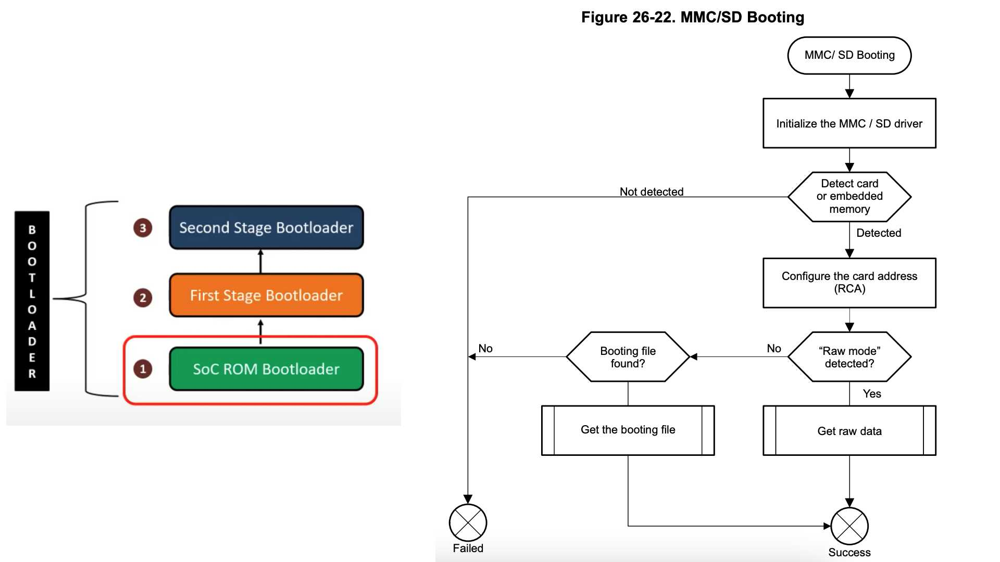

# Embedded Linux Booting Process (Multi-Stage Bootloaders, Kernel, Filesystem)

## Embedded System

If we want architectural look at an embedded system we are going to have the SoC which is the System-on-Chip or the microcontroller. This is the brain of the system.

It also needs a RAM where it can load programs at runtime and run, now apart from this depending on the functionality of this embedded system, there may be different peripheral ports, debug ports, GPIO pins, etc. available.

Now it's important to note that most modem SoCs typically support dozens of different external peripheral devices. However the number of pins on them are sometimes not enough to be able to interface with every device they support.

And this is really where a pin multiplexing happens where we can configure the SoC to go ahead and use certain pins and only go and talk with certain peripheral devices with them.

## Embedded Linux Boot Process

### Bootloader

- The SoC is powered and begins execution at the **reset vector**
  - The First Stage is the Bootloaders.
  - When we power a board, what happens is control passes to a location called **reset vector**.
  - The **reset vector** is something the manufacturer has already pre-programmed onto the board.
  - At the **reset vector** typically the associate ROM loader exits and at that point the **ROM bootloader** will start executing.
- Control given to the **ROM bootloader**

  - The **ROM bootloader** is to set up some basic hardware and then go about finding the **First Stage Bootloader** from a boot device
  - This boot could be a network, over a memory bus, USB or SD card, etc.

- ROM bootloader decides boot device order based on hardware pin settings into the internal SoC memory and passes control to it

- The **First Stage Bootloader** copies the **Second Stage Bootloader** into RAM and passes control it for starting running
  - Please keep in mind that passing control rather than calling, it is very important to distinguish.
  - Typically passing control actually means is after that the previous program which was running in a way seize to exist.
  - The "calls" means that when the next stage finishes running, it will return back to the previous stage which does not happen with boot loaders at all.
  - So when the **ROM bootloader** passes the control to the **Second Stage Bootloader**, the **ROM bootloader** is not going to run till the next reset.

Depending on the embedded system, there could be just one statge or multiple stages. All of this depends on the architecture of that embedded system, and how many stages it would require to load powerful boot like uboot.

### Kernel

- The **Second Stage Bootloader** reads its configuration settings (either statically embedded or external file)
  - The primary responsibility of **Second Stage Bootloader** is to go ahead and load the Kernel and the **Device Tree** into RAM.
  - Basically look at its own settings which could be statically embedded or this could be some kind of an external configuration file.
  - Using the **Second Stage Bootloader** and **Device Tree** to start the Kernel.
- Finds and loads the **Linux Kernel** and the **Device Tree Binary** into RAM
- Sets up the **Kernel Boot Arguments**
- Then passes control to the Kernel which uses the **Boot Args** and **Device Tree** address to initializes itself and hardware devices

### User

The kernel in turn is to initialize the different hardware components, and is going to go ahead look into the boot arguments passed by the bootloader, locate the root filesystem and then it will mount the root filesystem.

Once it's successfully does that it is going to search for the init process on the filesystem which is the really the first userspace process with PID 0, and then once it invokes the init process in it.

It in turn will look at this configuration files start other userspace processes.

- Using the **Boot Args**, the Kernel locates and mounts the root filesystem
- Kernel runs the **Init Process (PID 0)** to start userspace
- The **Init Process (PID 0)** now spwans other userspace processes based on the configuration files.

## Understanding BeagleBone Black

The BeagleBone Black is actually based on a Texas Instrument SoC called AM335x series.

### AM335x System Architecture

Copied from datasheet.

- **ARM Cortex A8 - Up to 1 GHz**

  - The reason they say "up to 1 GHz" is most of the time this is hardware configurable.
  - Based on certain pin settings you can tell the processor what is the clock speed it needs to use.

- **L1 and L2 cache**

- **ROM and RAM**

Keep in mind this is inside the SoC, so this is inside the little chip.

The key takeway is we have a very small ROM and a very small internal RAM.

### Memory Map

In the memory map, we would actually find is that the **Boot ROM**, which is 128KB + 48KB = 176KB in the functional block diagram. That is the place where execution begins after the processor resets.

The **Boot ROM** actually is a reasonably complicated piece of software and actualy pretty well complicated software.

- **BOOTP** means that it is able to do a network boot.
- Focush on **FAT**, **UART**, **SPI** and **MMC/SDCard**.

It probably doesn't occupy that entire space 176KB with actual code. It is fairly complicated and the **Boot ROM** code already talking to MMC/SD cards, and also supports the FAT system. These two important things you need to remember.

### Device Types

The AM335x SoC supports two different kinds of boots. One is the high-secure (HS) device or the HS device, and the other is the general-purpose device or GP device.

Here we are going to use general-purpose device. The high-secure device is kind of doing the trusted boot stuff. So it requires a digital signed, a piece of firmware and otherwise it is not going to boot it.

## ROM Bootloader

### ROM Bootloader: Init

- System initialization
- Sets up the Stack
- Sets up the Watchdog Timer (3 minutes)
- Configures the system clock (PLL configuration)
- Starts the booting process

### ROM Bootloader: Device Boot Order

The next statge is going to be external to the SoC, so how does the ROM Bootloader go about figuring out where to find the next statge.

The order in which the ROM bootloader is going to search for a boot device, it is something which the hardware designers have decided by using different PINs at highs and lows that tells the SoC that the order of bot to be followed.

So we come here set the booting device list based on the boot configuration settings since boot PINs. Fir each thoes devices figure out if it is a peripheral boot or if it is a memory boot.

In this case we are going to be doing a boot using the SD card so it's actually going to be memory booting.

So we are going down the memory booting part if it succeeds it kind of continues if not it is going to go back try the next device.

### ROM Bootloader: MMC/SD Card Booting

Assuming that the MMC or SD card is in the list, the ROM bootloader is going to initialize the driver and then after that decide whether the next statge bootloader is on the SD card in either raw mode, or is it there as a boot file.

### ROM Bootloader: Searching for "MLO"

The raw mode is where we just put the next statge bootloader and the file name of the next statge bootloader basically is **MLO**. So the next statge bootloader can actually be put into raw mode which it currently says you know has to be either at offset 0 or from 0 the first 128KB, or then up to 256 or 384.

Alternately what it can do is read fram a partition on the MMC or SD card. Based on this, we can choose one of these different options to locate the first-stage bootloader, now what we will do is use the FAT option.

And we can also do the raw mode boot where we will use `dd` to write the first statge bootloader and the second stage bootloader on to, to these exact locations and then boot the device.

## BeagleBone Black Boot Process

### Recap

The SoC ROM bootloader is within the SoC, with very small 176KB ROM is to boot the first-stage bootloader wihch is the SPL or MLO. SPL stands for **S**econdary **P**rogram **L**oader, MLO is for **M**emory **LO**ader.

In the step2-to-step3, the first stage bootloader is going to load the second statge bootloader, in the case of BeagleBone Black, we are going to be using a very popular bootloader called `U-boot`. And its configuration file which is `uEvn.txt`. `U-boot` is open source has a massive adoption in the embedded market.

In the step3-to-step4, the second stage bootloader is then going to bring up the Linux Kernel which can be `zImage` or `uImage` along with the device tree. Then the Linux Kernel in turn is going to bring up the root filesystem.

### Practical Demo

#### Before Poweering Up

- Internal RAM - 128KB
- ROM Bootloader - 176KB
- MMC/SD Card inserted (three partitions)
  - FAT32 partition contain the first statge bootloader which **MLO**
  - The second stage bootloader U-Boot and the second stage bootloader configuration file which `uEnv.txt` actually it's more of environment variables than actual config.
  - The second stage partition is an ext4 partition which is going to contain the Linux Kernel and the device tree binary.
    - The device tree basically kind of is nothing but an enumeration of all the non-discoverable devices and how to bring them up and how to power them on their power profiles, etc.
  - The third partition is what will contain the Root Filesystem that entire directory structure which all of us are so used to seeing.

### Step 1: Once Power Up

Step one we power up the SoC, the ROM bootloader starts running, and here the ROM bootloader is going to be using the second way to boot it, which it is going to search for a FAT32 partition on the SD card.

The ROM bootloader decides that it is going to look into the SD card in its boot sequence, and then inside that finds the FAT32 partition sees that there is an **MLO** file named **MLO** inside it. And then brings it into its internal RAM.

If **MLO** does not exist, then boot will fail from the SD card and then
the ROM bootloader will move on to the next device in the list.

So step one to summarize, it gets the **MLO** puts it into the internal RAM and then passes control to it.

### Step 2: MLO to U-Boot

Now the **MLO** in turn will check for U-Boot and then copy U-Boot on to the RAM. Now this differentiation is very critial. If you notice the ROM bootloader got **MLO** into its internal RAM while **MLO** got U-Boot into the extenral RAM. This is very important.

U-Boot in turn is actually going to check the `uEnv.txt` is present, and then copy that out to the RAM as well.

### Step 3: U-Boot to Kernel

Now the U-Boot is going to fetch the Linux Kernel and the Device Tree Binary. How would you boot actually know that there is an EXT4 partition, and it is the second partition, etc. All of that information is actually there in `uEnv.txt`.

So U-Boot now fetches the Linux Kernel and the Device Tree Binary, loads them up into RAM, and also passes the boot arguments and then passes control to the kernel.

### Step 4: Kernel to Root Filesystem

Now kernel will mount the Root Filesystem and then run the Init Process from the Filesystem in RAM. The Init Process in turn will initiate other userspace programs.
