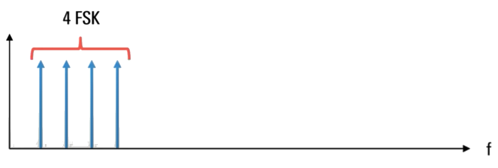

# Understanding APSK and QAM

## About modulation

- Modulation conveys information by changing some aspect of a RF carrier
  - Aplititude, frequency and or phase

Modulation is the process whereby we change some aspect of an RF carrier in order to convey information that is the carrier's amplitude.

- Analog modulation (AM or FM) is typically used for analog signals (e.g. voice, music)

### About digital modulation

The carrier is shifted between these different states or symbols depending on the bit pattern that's to be sent.

- Digital data is sent using different "state" or "symbol" which correspond to different bits:
  - **Amplitude shift keying (ASK)**: different amplitudes
    
  - **Frequency shift keying (FSK)**: different frequencies
    
  - **Phase shift keying (FSK)**: different phase transitions
    

## APSK

### Limitations of ASK, FSK and PSK

- Used mostly for lower-rate digital data
  - Cannot meet modern high-rate data transmission requirements, such as those provided by Wi-Fi and cellular technologies.
- One way of increasing throughput is by increasing the number of symboles ("modulation order").
  - For example, we can increase the number of frequencies used in **FSK** to have more bits per symbol.
    - In the case of **2FSK** or **bpsk**, there's only one bit per symbol.
      
    - **4FSK** has 2 bits per symbol.
      
    - **8FSK** has 3 bits per symbol.
      
    - **16FSK** has 4 bits per symbol.
      
- There are limits to the maximum practical order in these modulation scehmes.
  - **ASK**: Limited to noise beacuase it uses amplitude differences to represent different states.
  - **FSK**: High modulation orders in **FSK** have wider bandwidth requirements

### From PSK to APSK

- Practical upper bound to PSK modulation order
  - Because all the symbols lie on a single amplitude circle.
    
  - The distance between the symbols decreases as modulation order or the number of states increases.
  - When the states are very close together, errors become more likely.
- Solution: add amplitude states
  - Concentric circles with different, but constant amplitudes
  - Same number of points, but split across differnt circles
  - Points are now further apart
  - Reduce the risk of error and allows higher modulation orders (= higher throughput)
- Combinaion of **PSK** and multiple **amplitude** states is called **APSK** (amplitude and phase shift keying)
  

### APSK example constellations

Let's look at two examples of **APSK** constellations.

In the **16APSK** constellation we have two amplitude states and eight symbols per state. 16 states means that each state can carry or represent 4 bits.

The **32APSK** canstellation has 3 amplitude states, the inner amplitude level has only 4 symbols. The middle amplitude state has 12 symbols, and the remaining 16 symbols are in the outer amplitude state. 32 states means that each of these symbols corresponds to 5 bits.

Note however that other arrangements of the 32 symbols are also possible, such as a **32APSK** constellation with 4 amplitude levels.

### Applications / advantages of APSK

- Main applications in satelites
- Statellites are propably the most important application of **APSK**.
  - **APSK** is part of the **DVB-S** or digital video broadcast satellite specifications.
  - In addition to other modulation types, the **DVB-S2** standard includes support for **16APSK** and **32APSK**.
  - The newer **DVB-S2X** standard adds support for **64APSK**, **128APSK** and **256APSK**.

One of the main reasons for using **APSK** in satellite applications is that **APSK** is robust with regards ot various amplitude effects, and it allows the use of non-linear amplifiers.

For example non-linearity such compression may change the relative distances between different amplitude rings. But all the points in one given amplitude ring will be equally affected which minimizes the impact of this non-linearity.

In fact, **_APSK_** allows the distances between the rings to be pre-distorted so that the rings are the correct distance apart after non-linear amplification.

**APSK** provides further flexibility in that the number of rings and the distance between the rings can also be chosen or adjusted in order to balance distortion versus peak average power ratio.

- **APSK** robust with regards to amplitude effects
  - All points on a ring are equally affected by amplifier non-linearities, .e.g. compression
  - Distance beween rings can be predistorted
  - Number of rings and distance between rings can be adjusted to balance distortion versus peak-to-average ratio

## QAM

### About Quadrature Amplitude Modulation (QAM)

Many digital modulated signals especially higher order signals are created using something called **IQ**.

In **IQ** modulation, an "in-phase" or _I_ component is combined with a "quadrature" or **Q** component to produce a modulated signal. Quadrature simply means shifted by 90 degrees.

The result of this **IQ** modulation is a constellation diagram where the points are arranged in a square shape, each point having a unique combination of amplitude and phase.

{width="50%"}

In this example, this **16QAM** signal carries 4 bits per symbol. If we increase the modulation order or number of states to 64. Each point in the resulting **64QAM** constellation now correspoinds to 6 bits.

**Summary:**

- Combines amplitude and phase shifts
- Many digital signals created using "IQ" moduation
  - Quadrature = shifted by 90 degrees
- Resulting constellations are usually square

### QAM modulation order

Recall that increasing the modulation order or number of states has two main effects. First, the higher number of bits per symbol mean that the achievable bit rate or throughput also increases. On the other hand, higher order modulation also reduces resistance to errors since the states or symbols are now closer together.

That said **QAM** is capable of supporting very high modulation orders, some of the more common quant variants are **16QAM**, **64QAM**, **256QAM**, **1024QAM**, and **4096QAM**, although other orders are possible.

Usig **4096QAM** as an example, this very high order modulation scheme represents 12 bits with every symbol, so the data rate is quite high. However, we can also see that constellation points are very close together, so the probability of error is also much higher.

Therefore very high order qual modulation tends to be used most often in cable systems where the envrioment is more controlled and less susceotible to noice and interference.

Many over-the-air systems (cellular, Wi-Fi) often dynamically adapt modulation order based on the channel conditions. For example using **256QAM** are good, but falling back to **64QAM** or **16QAM** in the presence of noise interference, etc.

**Summary:**

- Increasing the modulation order (number of states)
  - Increase bit rate / throughput
  - Reduces resistance to errors
- More commone **QAM** variants **16QAM**, **64QAM**, **256QAM**, **1024QAM**, and **4096QAM**
- Very high order modulation is most often used in cable systems (more controlled environment)
- Many over-the-air systems (cellular, Wi-Fi) often dynamically adapt modulation order based on the channel conditions
  - Higher order when conditions are good
  - Fall bac to lower orde rwhen conditions are poor

### Comparing QAM and (A)PSK

Let's compare **PSK**, **APSK** and **QAM**:

- Commons:

  - using the same modulation order
  - constellations have 16 states
  - transmit 4 bits per symbol

- Differences:
  - **QAM** points or symbols are spaced further apart and even more distributed than both **PSK** and **APSK**.
  - More distance between points means more resistance to error, check the number of amplitede states:
    - **16PSK** only has a single amplitude state
    - **16APSK** has two amplitude states
    - **16QAM** has three amplitude states
    - Increasing the number of amplitude states places higher linearity requirements on amplifier and transmiters due to higher peak to average power ratios.

![compare_psk_apsk_1.png(./images/compare_psk_apsk_1.png)]

### Defining "QAM"

- For many people, **(A)PSK** = "round" and **QAM** = "square"
- "QAM" is sometimes also used generically to refer to any IQ-based modulation
  - Example: Wideband HF (MIL-STD-188-110D)

The **Wideband HF (MIL-STD-188-110D) specifications** refer to this constellation as **16QAM**, although it actually consists of two **PSK** rings, it enters **4PSK** ring and an outer **12PSK** ring. Likewuse this **32QAM** constellation from the same specification, consists of an outer ring of 16 symbols arranged in a **PSK-like** circle, and an inner square of **16QAM-like** symbols.

But in most cases the **PSK** round **QAM** square distinction is a reasonably good rule of thumb.

## Summary

- **ASK**, **FSK**, and **PSK** provide limited data throughput
- Combining amplitude and phase modulation allows much higher bit rates
- **APSK** adds amplitude states to **PSK**
  - More widely spaced symbols
  - Primarily used in satellite applications
- **QAM** also uses amplitude and phase shifts
  - Based on **IQ** modulation
  - Very high orders (bit rates) achivable
  - Used in most moderm communication technologies
