# I2C notes

## I2C microcontroller basics

### I2C in a microcontroller(MCU)

The I2C bus is a bidirectional interface that uses a device known as a master to communicate with slave devices.

An I2C master, which is the device that is responsible for controlling the I2C bus, with almost always be a microcontroller, which is also known as an MCU.

Microcontrollers are highly configurable devices that offer a mix of hardware and software capabilities.

### I2C Overview: Bus with MCU

A single I2C bus can enable an I2C master to theoretically communicate with over 100 slave devices.

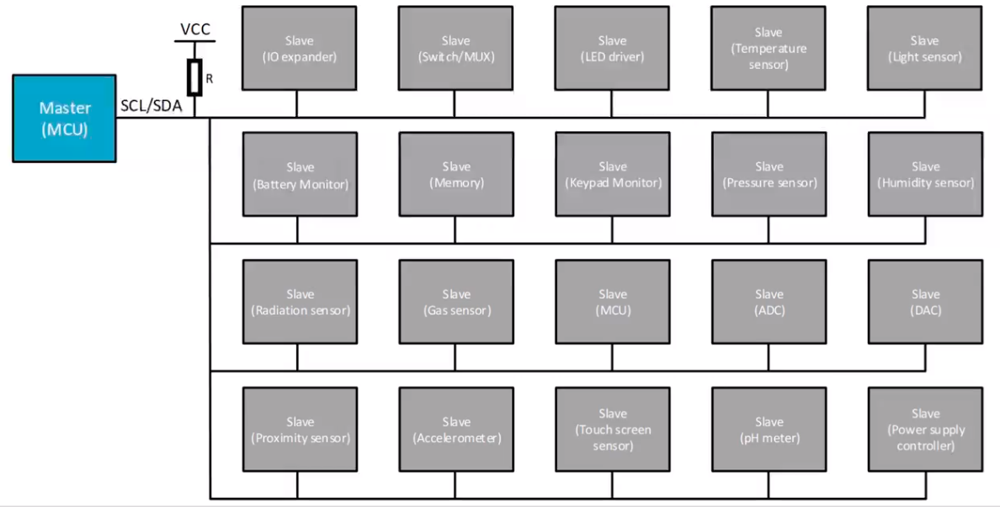

An I2C master is almost always an MCU. But even for I2C slaves, it is common for them to be MCU as well.

A few common MCU slave examples are secondary system monitoring MCUs, touch screen sensors or controllers, gas sensors, gas sensors, or possible memory emulation.

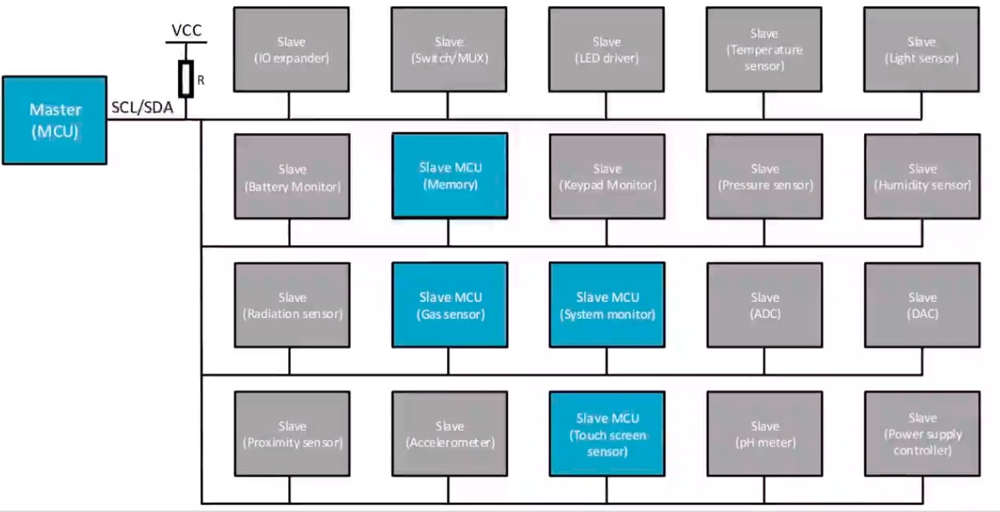

### MCU I2C: General purpose inputs/outputs(GPIOs)

What is the first step to configure MCU for I2C communication is to configure the general purpose input/output pins, otherwise known as GPIOs.

GPIOs will often be shared between many different peripherals inside the MCU.

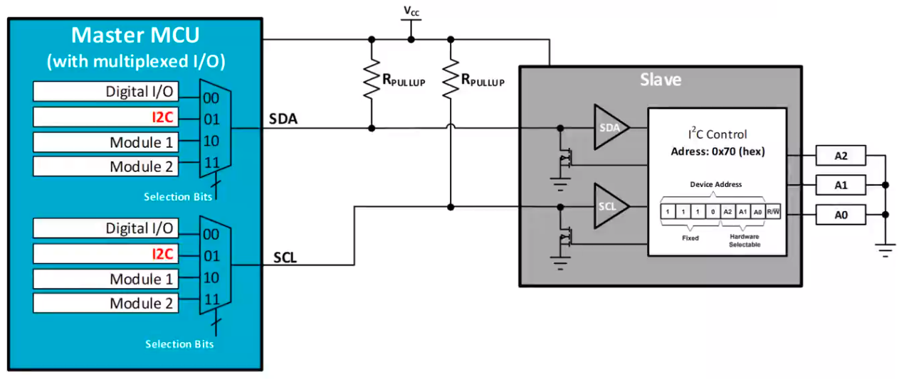

To support this, most GPIOs will have a mux to select and enable the desired functionality. This is the first step of interfacing an I2C on an MCU.

In the example, this GPIO mux defaults when the selection bins are 00, to a generic digital input/output functionality.

To connect the internal I2C peripheral of the MCU to the I2C bus, the GPIO mux selection bits must be set to `01` for both pins.

### Hardware I2C control

In a MCU, there are two of types of I2C controllers, hardware and software.

Hardware I2C means there is a physical peripheral in the device that is dedicated to serial I2C communication.

Hardware I2C modules can vary in levels of complexity and capability, but usually have some core overlap. The first thing that every hardware I2C module will have is a shift register.

This is used for shifting data out a bit by bit when receiving.

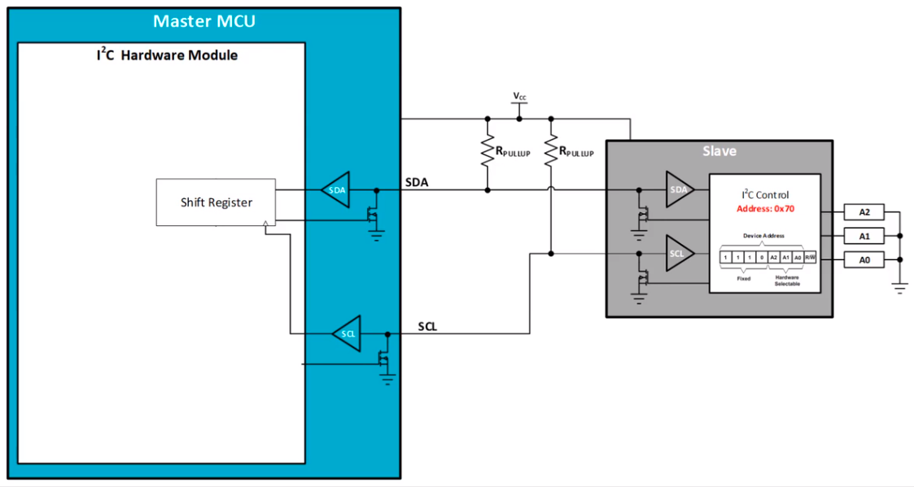

The shift register can only be written or read at very specific points in time to avoid corrupting any data.

To make data transfers easier, hardware I2C modules often include transmit and receive buffers that interface with the shift register.

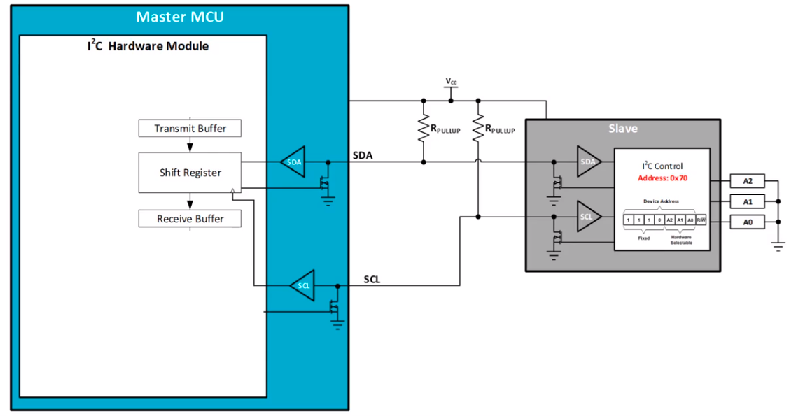

Instead of having to inerface with the shift register directly and at specific times, these buffers allow data bytes to be preloaded and are transferred into the shift register automatically when it is rady.

When a buffer needs more data or needs to be read, it generates an interrupt in the MCU to let it know that it's time to be serviced.

Overall, this makes data handling much simpler for both transmitting and receiving and reduces processing overhead of the MCU.

Another feature to make communication simpler when the MCU us acting as an I2C master is the addition of a slave address register.

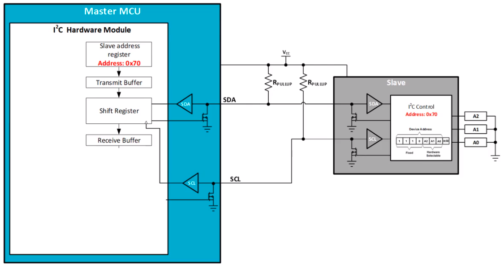

This is a register that is loaded with the address of a slave device that the master is trying to communicate with, and in this example, is 70 hex.

The slave address register can feed the address directly into the transmit buffer, automatically handling the start of a new transaction.

In the reverse case, where the MCU is actin as an I2C slave, there may also be an own address register. This is where the I2C slave address for the MCU can be configured.

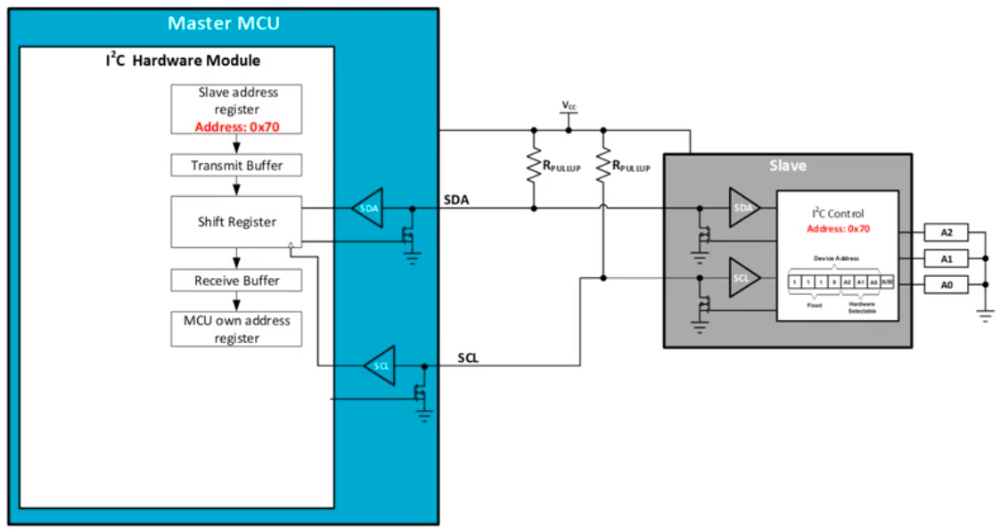

Unlike the I2C slave address for the analog sensor which is a mostly fixed address, the I2C slave address for the MCU is configurable to any 7-bit value.

When in I2C slave mode, a received address can be automatically compared to the MCU's own address register and interrupt the MCU if there is a match. This allows the module to automatically determine if it is the target slave device or not.

Another important responsibility of the I2C hardware module is clock generation and management. In master mode, the module will be driving the SCL line for all the slave devices.

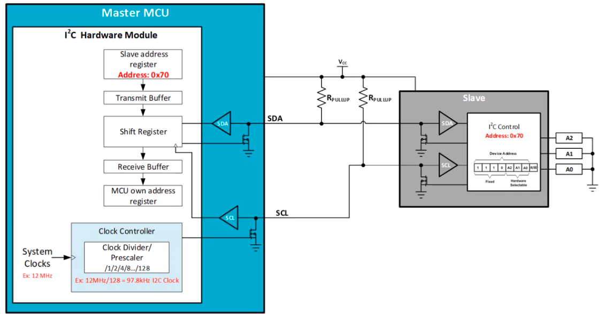

The clock generation is typically a clock divider to get the MCU clock frequency to the correct SCL frequency. In this example, the MCU clock is 12MHz, but it is divided down by the I2C clock divider to 97.8KHz, which is the ideal frequency for standard speed I2C.

Finally, the I2C module will have some kind of hardware state machine. This state machine will handle the peripheral behavior as well as the I2C protocol.

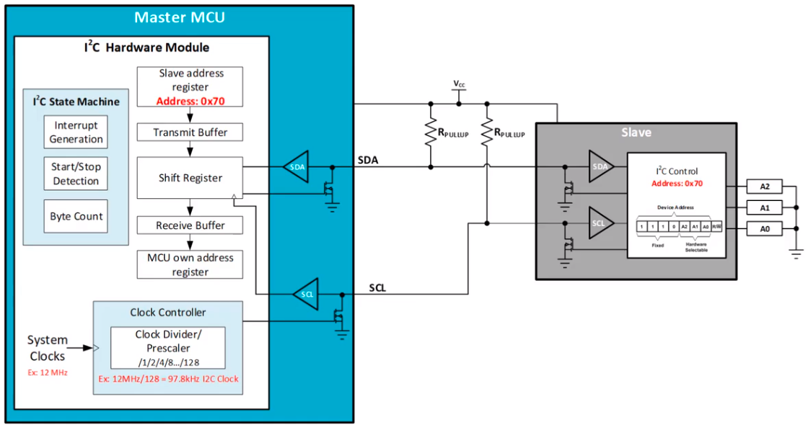

It will manage the data, start-stop it detection and generation, and interrupts needed for MCU.

A hardware I2C module may seem complicated, but it is the most efficient and easiest way to implement I2C communication on an MCU.

### Software I2C Control

Software I2C, or otherwise known as bit-ranged I2C, has none of the built-in features found in a hardware I2C module. It is an I2C functionality implemented purely in software.

In a software I2C, the SDA and SCL lines are connected to standard GPIOs, which are toggled manually, and all data handling and decoding is also done in the software.

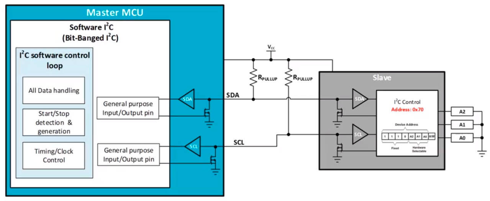

Software I2C has some clear disadvantages, mainly that it requires a high amount of the MCu processing bandwidth and due to that, will usually run much slower than a hardware I2C.

Even with these disadvantages, software I2C is still sometimes a very good option. Software I2C can be used to add an additional I2C bus to an MCU that is all out of I2C hardware modules. It can even be used in small, low-cost devices that have no I2C hardware module.

In both of these cases, using a software I2C will typically allow for cheaper MCU than one with a hardware module.

### Slave Address

When an I2C master is addressing an I2C slave, it's important to note that the 7-bit slave address is left-shifted 1 bit in the data byte.

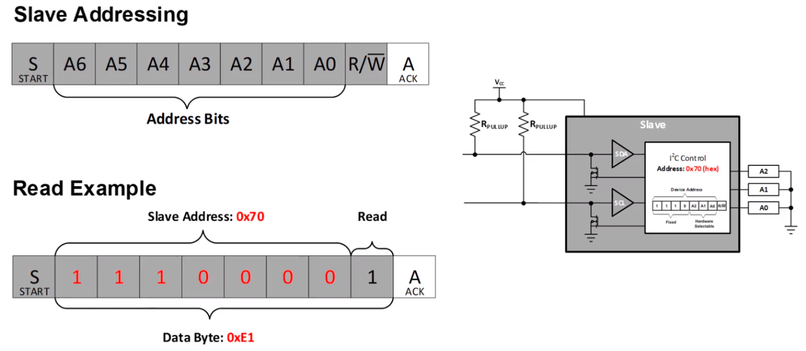

When actually addressing the slave, the address needs to be shifted left. Even though the slave address is 0x70, after it has been shifted and a 1 has been added to indicate a slave read. The byte transmit on the I2C bus is actually 0xE1.

This functiaonlity is typically handled automatically in the hardware I2C, but not software I2C. It's also important to remember when using a logic analyzer to monitor the I2C bus to understand which slave is being addressed.
