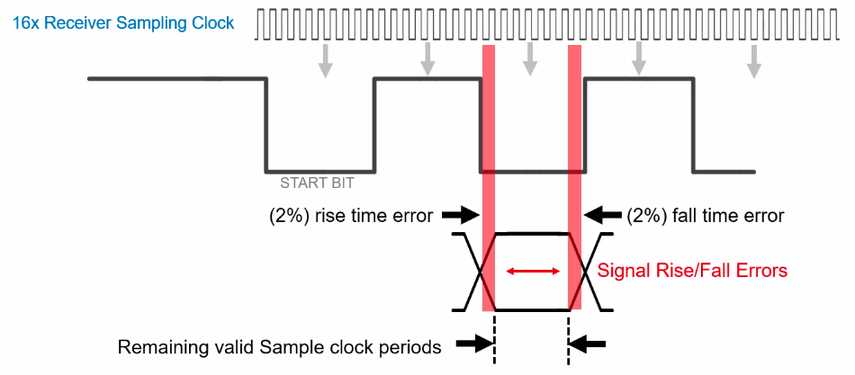

# Notes of UART

## Understanding UART

### What is UART?

- Universal asynchronous receiver / transmitter
- Protocol for exchanging serial data between two devices
- Uses only two wires
  - TX to RX (each direction)
  - Both ends also require a ground connection

- Can be simplex, half-duplex, or full-duplex

### UART application - What is UART? used?

- UART was one of the earliest serial protocols
  - Serial (COM) ports, RS-232, modems, etc.

- Popularity of UART is however descreasing:
  - SPI and I$^2$C between components
  - Ethernet and USB between computers and peripherals
- Still import for lower-speed, low-throughput applications

### About timimg / synchronization

- UART is asynchronous - the transmitter and receiver do not share a common clock

- The transmitter and receiver therfore must:

  - Transmit at the same (know) speed
  - Use the same frame structure / parameters

- Common UART baud rates
  - 4800
  - 9600
  - 19200
  - 57600
  - 115200

### UART frame format

- UART frames consist of:

  - Start / stop bits
  - Data bits
  - Parity bit (optional)

- High voltage ("mark") = 1, low voltage ("space") = 0

- In the idle state, the line is held high.

### Start and stop bits

- The start bit indicates data is comming
  - Transition from idle (high) to low
- The stop bit(s) indicate data is compelete
  - Stay / return to idel (high)
  - Second (optional) stop bit
    - No common in practice

### Data bits

- User (useful) data (comming after the start bit)
- Length: 5 to 9 bits (usually 7 or 8)
- Data is typically sent with the least significant bit (LSB) fisrt

- Example:
  - 7-bit ASCII 'S'(0x52) = 101 0011
    - LSB order = 1100 101
      

### Parity bits (optional)

- Used for error detection
- **Even parity:** number of 1's must be even
- **Odd parity:** number of 1's must be odd

- Example:

  - 7-bit ASCII 'S'(0x52) = 101 0011 -> four 1's
  - If even parity, parity bit is 0 (because number of 1's already even)

  

- Can detect a **single** flipped bit only

### Summary

- UART = universal asynchronous receiver / transmitter

  - Simple, two-wire protocol for exchaning serial data
  - No shared clock - baud rate must be configured the same on both sides
  - Start / stop bits used to frame user data
  - Start / stop used to frame user data
  - Optional parity bit for detecting single-bit errors

- Widdly used serial data protocol, but slowing being replaced by SPI, I$^2$, USB and Ethernet

## UART: Microcontroller overview

### UART

- Universal Asynchronous Revceiver Transmitter
- Features
  - Fully programmable interface
    - Programmable baud rate generator with over sampling
    - 5, 6, 7 or 8 data bits
    - 9$^th$ bit for single master/multiple slave bus schemes
    - Even, odd, no-parity bit generation and detection
    - Line break detection
    - LSB-first or MSB-first data transmit and receive
    - Hardware flow control
  - Separate transmit and receive buffers
    - Multi-byte fixed or programmable level FIFO (to reduce CPU buffer loading)

### UART Block Diagram

At a functional level, a UART has three primary features:

- transmiter
- receiveer
- clock generator

#### Transmitter

The transmitter has a transmittor buffer and shift register and performs a parallel to serial conversion. A byte loaded into the transmitting UART's buffer and is converted and transmitted one bit at a time through the shift register.

Transmit control logic outpts that serial bitstream beginning with a start bit followed by the data bits, parity bit, and stop bits according to the program confiuration in the control registers.

The transmit logic also notifies the CPU when the transmit buffer is empty, and at a minimum we'll have one transmit data buffer register. Others may offer multiple buffers with either a fixed or programmale threshold known as FIFO. These FIFO buffers help reduce the CPU interrupt service loading.

#### Receiver

The receiver also has a shift register and a receive buffer, and performs a serial to parallel conversion on the received bitstream after a valid star has been detected by the receiver control logic.

Overrun, parity, frame error checking, and line break detection is also performed by the control logic. After the stop bit has been detected, the bits are reassembled into a data byte and placed in the receiver buffer. The control logic notifies the CPU when data has been received.

#### Clock Generator

The clock timing for the transmit and receive shift registers and logic is provided by the UART's clock generator.

The clock generator takes an incomming system clock and creates two output clocks, one clock for the transmit section. Commonly referred to as the bit clock or baud rate clock, and a faster clock is used for thereceiver for bit sampling.

The transmitter and receiver modules also have control logic, which provides status information and control for each module and for the various protocols supported by the UART that are not convered in detail here.

### UART Transmitter Operation

The UART's transmit module's responsibility is to convert a data byte into bits and transmit each bit serially out of the UART's TXD pin. This function is imeplemented using a buffer, serial shift register, and transmit status, and control logic.

The UART's buffer size can be one data byte, or multiple data bytes in a FIFO queue, depending on the UART. The buffer reduces the time needed to manage the UART's transit buffer by the CPU.

The transmit control logic manages the movement of each data byte into the UART's shift register. The data's parallel to serial conversion is performed by the shifting the data one bit at a time out of the TXD pin.

- CPU loads byte into buffer register

  - To transmit a byte, the CPU checks transmit buffer flag to see if the buffer is empty.
  - If the transit buffer is empty, the CPU writes a byte into the transmit buffer.
  - If you are has multiple buffers or FIFO. The CPU can load additional bytes until the FIFO is full.
    

- Byte transferred to shift register

  - If the shift register empty, the first byte in the buffer is immediately transferred from buffer into the shift register.
    

- Bits shifted out
  - The control logic enables the bit clock to begin clocking the bits out of the transmit pin.
  - After the last bit from the shift resgister is shifted out, the next byte in the buffer or FIFO will automatically transfer into the shift register, and the sequence will repeat.

### UART Receiver Operation

Like the transmitter, the UART's reciver module also has a serial shift register, receive buffer, and control logic, and is responsible for assembling an incoming serial bitstream into a parallel data byte that can be read by the CPU.

- Shift in bits

  - The process starts by shifting the incoming bits into the shift register.
  - Because of the UART's asynchronous nature, the receiver module samples the RXD pin to know when a bit has arrived and correctly determine if it is a 0 or 1.
  - The receiver's logic is able to synchronize with the start of each new bit stream by detecting a falling edge of the first bit in the stream, known as the start bit.

  

- Transfer to buffer when full and notify CPU

  - When the shift register is full, the bits are transferred to the receiver's input buffer or FIFO, and a flag is set.

  

- CPU reads byte data
  - The CPU can monitor the recevie buffer flag to know when to read the data from the received buffer.
  - In this example, the data read by CPU is 0xAC.

### UART Clock Generator

- System Clock

  - The generator's clock source typically comes from a system clock.

- Dividers and Oversample

  - Through the use of divivders and oversampling features, that UART's clock generator generates two clocks.

- Transmit clock (bit rate clock)
  - One for the transmitter referred to as the bit rate clock or baud clock.
- Receive clock (sampling clock)
  - The other for the receiver referred to as the sample clock.

While the transmitter operates at the bit rate clock frequency, the receiver requires a higher clock frequency, typically multiple times higher than the bit rate clock frequency.

The higher frequency sampling clock is used by the receiver's logic to determine the value of each arriving bit at the RXD pin by sampling the logic levels several times over the duration of each bit period.

### UART Receiver Clock

- Typical Over Sample Clocks are 3x, 8x or 16x faster than transmit clock

  - The receiveer requires a clock frequency that is higher than the transmit clock frequency to create a sample clock.

- RXD pin sampled during one bit period
  - This higher frequency sampling clock enables the receivers to shift register and control logic to sample the incomming voltage levels on the RXD pin multiple times over the period of one bit clock.
  - The receiver uses these samples to determine if the incomming bit is a valid 1 or 0.

### UART Receiver Bit Sampling

- 16x over-sampling means receiver clock is 16 times faster than baud clock

  - Understand that for each byte that is transmitted, the data bits are always preceded by a single start bit, which is a high to low transition on the RXD pin and signals the beginning of a UART packet.

- Start-bit synchronizes the receiver to the incoming data

  - In between receiving data packets, the receiver continously evaluates the voltage level on the RXD pin every sample clock cycle waiting to detect the falling edge of the start bit.
  - When the falling edge of the RXD pin is detected, the receiver's sampling clock is synchronized to the UART packet.

- Receiver samples RXD pin around mid-point bit period

  - The synchronization occurs with every packet received, so this provides a simple method for synchronizing the transmitter and receiver.

- Majority rule samples on 7th, 8th and 9th sample clock cycles typically

  - What happens next is referred to as the majortiy rule and may vary from UART to UART.
  - If the RXD pin is low duing each these three samples, the bit is delcared a `0`.
  - If, on the other hand, the RXD pin is high for each of these three samples, then the bit is declared a `1`.
  - Note, the start bit may be sampled times rather than three and may be sampled earlier in the bit period bit on some UARTs.

So which oversample rate is best to use? It depends, consider, though, when using 16x, sampling the power consumption can be higher than if using 8x or 3x over sampling.

Another consideration when using a 16x sample clock, you have 1/16 of time difference between the sampled part bit edge and the real received edge. This means you could already be wrong 1/16 or 6% into the bit period, and with an 8x sample clock, 1/8 or 12.5%.

Generally when using 16x oversampling, any UART to UART baud rate frequency differences can be more realized compared to when using an 8x oversampling, where are to UART to UART baud rate difference must be more tightly controlled.

- No two clocks will always be exactly the same frequency

  - Due to the difference in system clock sources for any two UARTs, configuring the UARTs to operate at the same baud rate frequency does not always guarantee the frequencies will be exactly the same.

- Small differences or jitter can be tolerated
  - In fact, in most all cases the frequencies will never be exactly the same, especially when you consider that one or both UART frequencies may change over temperature or may introduce some clock jitter.
  - These differences, if small, can be easily tolerated, because the receiver samples around the midpoint of each bit.

### UART Clock Baud Rate

Previously, the divider purpose is to reduce the input clock frequency to support a wide range of lower transmit baud rates.

The UART's divider is typically a combination of two divisors.

- Integer baud rate divisor (IBRD)
- Fractional baud rate divisor (FBRD)
- BRD = IBRD + FBRD

  - Which depending on the combination of the input frequency and divisor can typically meet the desired baud rate.
  - Some combinations of input clock and divisor may not produce an exact baud rate that is needed.
  - The fractional portion of the divisor is used to help achieve clock frequencies with very good accuracies that would otherwise not be possible using an integer divisor only.
  - Refer to your UART's documentation regarding baud rate error calculations.

  **_BRD = (System Clock) / (Oversample x Baudrate)_**

- Example
  - Baud = 19200
  - Oversample = 16
  - System Clock = 20MHz
  - BRD = 65.104
  - Integer value = 65 = IBRD
  - Fractional value = 0.104 -> formatted = FBRD

### UART Connections

- 2-wire

  - Most UART applications support
  - TXD pin -> transmit data
  - RXD pin -> receive data
  - Both UARTs must agree to use the same frequency or rate at which data is transmitted and received, known as the baud rate.

- 4-wire with Flow Control

  - Some UARTs can also support a 4-wire interface for flow control using two additional pins, RTS and CTS.
  - The RTS output signal indicates that the UART is ready to receive data, while the CTS signal controls
  - CTS and RTS are also cross-connected between two UART.

- Note on shared IO pin configuration
  - On many MCUs, the UART's pin, inputs and outputs are not always available on dedicated I/O pins.
  - In stead, the UART shares its signals with other input and output funcitons, such as timer outputs, ADC inputs, and general purpose I/O.
  - This is especially true for smaller pin count devices.
  - If this is the case, configure the I/O pins as recommended in the MCU's documentation.

## UART Protocol Overview and Error Sources

### The UART

- UART - Universal Asychronous Receiver Transmitter

- Requires only 2-pins, RXD and TXD

  Because the UART only needs one pin to transmit and one pin to receive data, the UART transmitter must first convert a data byte into serial stream or sequence of 1's and 0's. And then reverse this process when receiving.

  

- No additional synchronization pin or clock signal is needed

  Unlike other interfaces, which use a clock signal for synchronizing their data transfers, the UART is asynchronous, or has no shared synchronizing signal.

- Synchronization by adding `START` and `STOP` bits to data

  In order to correctly interpret data, the UART uses a hardware protocol which provides synchronization by adding a couple of extra bits to the data sequence.

### UART Hardware Protocol

- UART Data Frame

  During a data transfer, UARTs don't send or receive just data bits. Instead, the data bits are grouped along with some synchronization and error-detection bits to form a single data frame or character.

  

  The frame begins with the `START` bit, followed by the data to be transmitted, then an optional parity bit, and finally one or two stop bits.

- `START` bit - synchronizes receiver to start of frame

  The `START` bit signals the beginning of the frame by transitioning from a logic-level `HIGH` to a logical-level `LOW` on the transmitter TXD pin, and is held `LOW` for one baud-clock period. This allows for the receiver to synchronize its internal clock with incoming data.

- Data bits - data

  A portion of the frame is typically represented by 7 or 8 bits, and for legacy reasons, many UART support as few as 5 data bits.

  The data portion of the frame is transmitted `LSB`, or at Least Significant Bit, first. However, most modern UARTs support `LSB` or `MSB`, Most Significant Bit, ordering.

- `PARITY` bit - single bit error detection (optional)

  The `PARITY` bit is optional that can provide a simple bit-error detection scheme that can detect bit errors in the data.

- `STOP` bit - signal end of the frame

  The stop bit signals the end of the UART frame, as a logic-level `HIGH` for one baud clock. After the `STOP` bit, the TXD output remains at a logic-level high indefinitely or until the next `START` bit.

- Second `STOP` bit (optional)

  The optional second `STOP` bit can be used to extend a frame's transmit time by one additional baud-clock period.

  This additional period allows the receiving MCU a little more time to read the current data byte in the UART receive buffer before it's overwritten with the data in the incoming frame.

### UART Parity Example

- `PARITY` provides signal bit error detection (optional)
- `PARITY` options are Even, Odd, None
- Both UART's must be configured the same

- Transmitter generates `PARITY` bit

  - Even Parity configuration
  - Sume of frame = 6 (even)
  - `PARITY` bit set to 0

  

- Received correct packet

  - Count number of 1's
  - Add `PARITY` bit value
  - If sume is even, data is valid

  

- Received incorrect packet

  - Noise changes bit `D1`
  - Count number of 1's
  - Add `PARITY` bit value
  - Sum is odd, data is not valid
  - Parity error flag set

  

### Baud Rate - Maximum Error Tolerance

- Baud Rates Review
  - Common Baud Rates are 9600, 19200, 115200
  - UARTs must be same baud rate
  - System clock and Baud Rate Divisor (BRD)

In real-world UART applications, there are inherent timing errors that come from the difference between the transmitting and receiving baud rates, as well as timing errors associated with the UART's receivers bit-detection scheme and error propagation.

- Typical maximum baud rate error tolerance is 2-3%

  Reliable communication with slightly different baud rates is possible because typical systems have a baud rate tolerance of roughly 2% to 3%.

  Beyond this limit, communications will begin to become unreliable.

- Bit error accumulation
- `START` bit synchronization
- RX signal rise and fall times

Commined, these sources establish the maximum frequency difference between the transmitting and receiving baud rates before communications become unreliable.

### Baud Rate Accumulation Errors

- Receiver uses oversample clock (16x baud rate clock)

  The receiver is able to determine the value or state of each data bit by using an oversampling clock. An oversampling clock is typically 8 or 16 times faster than the baud clock. This faster clock is used by the receiver logic to make multiple samples during a data-bit period.

  In particular, the midpoint sample represented by the gray arrow, is where the receiver logic determines the bit value or state as either a 0 or a 1.

  

  Ideally, the receiver samples each bit period in exactly the middle, as represented by the gray arrow.

- Faster baud rate

  However, the transmitting baud clock may be slightly faster or slower than a nominal baud rate.

  

  We can see that each bit's midpoint(green arrow), arrives slightly sonner relative to when the receiver samples in that period.

  The difference between the bit's actual midpoint and when the receiver samples the bit, is the bit-timming error.

  Notice that with each subseuqent bit, the errors accumulate. If the accumulated error becomes greater than the bit's period, the receiver will incorrectly read the bit values.

- Slower baud rate

  

  The errors accumulated in the opposite direction.

- Theoretical Maximum Accumulated bit tolerance

  In an ideal scenario, the receiver and transmitter baud rates are exactly the same. The receiver's sampling logic correctly samples the midpoint of each bit as represented by the gray arrow.

  This leaves room or margin for the transmitter's baud rate to be slightly faster or slower relative to the receiver's operating baud rate and without causing any communication failures.

- Bit error or margin of error

- Example with a faster clock:

  - Accumulated error = $\pm$40% over 10 bit periods

  In our example, we use a common UART data frame, which uses 10 bits a start bit, 8 data bits, and a stop bit. The baud rate isd operating slightly faster than the receiver, which causes a 40% accumulated bit-timming error over the 10 bits.

  

  Since the 40% is within the plus or minus 5% margin, no bit errors occurred.

### Start bit Synchronization Error

Another error comes from the UART's sampling scheme, known as the `START` bit synchronization error.

- `START` bit falling edge
  

  When the receiver's hardware detects a `START` bit, it synchronizes its sampling clock to this edge. This synchronization can take up to one sample clock.

- Sampling clock synchronization tolerance

  

  Once synchronized to the incoming bitstream, the UART receiver samples where it thinks each subsequent bit midpoint should be. But in reality, it can sample up to one clock cycle later than the midpoint.

- 1/16 clock or 6.25% of the `START` bit period

### RX Signal slew rate (rise/fall times)

- Rise/Fall timing delays

- Caused by added capacitance

  - On the TX and RX signal paths
  - Can be quite large

The voltage levels during these periods have not stablizized, so this effectively increases the timing error by the amount of the rise and fall delay.

In this example, let's assume a rise and fall delay of approximately 2%.

### Example Baud Rate Error Tolerance Calculation

Let's perform a calculation to find the maximum tolerable difference between the transmitter and receiver clock before a bit error occurs.

