# Getting pixels on screen on Linux - Introdution to Kernel Mode Setting

## 1. What is KMS?

### 1.1 How to get an image on screen?

Basically when an app wants to get something display on screen, a regular app don't talk to the kernel for display. A regular app talk to a display server: e.g. X11 or Wayland.

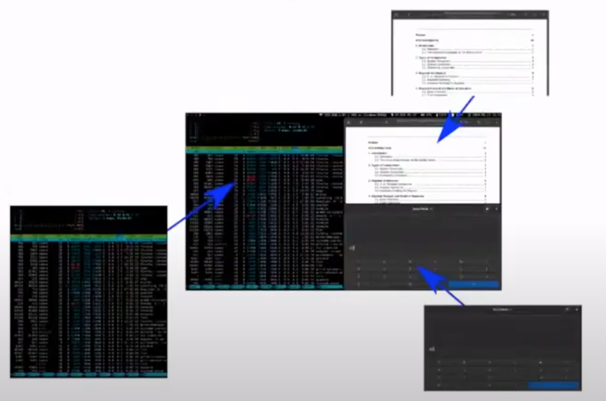

For instance, if we have a terminal application, it renders an image and then it hands over the image to X11 or Wayland. And then the compositor is responsible for taking images from multiple clients blending them togther in a single image, and then the compositor talks to the kernel.

So the compositor here is running in userspace, it will hand over images to the kernel via **KMS** API.

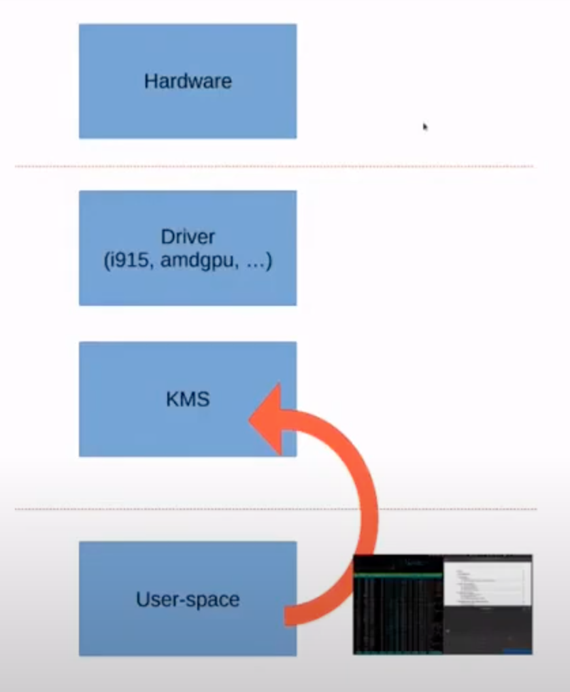

**KMS** has a common code but also has a driver specific code, so for instance the _i915 driver_ will drive GPUs produced by Intel, but also drivers for other vendors AMD GPU for AMD, and so forth. And the driver will be able to directly program the hardware.

So **KMS** is a unified interface, so we don't need to write driver specific code basically, we can write code that works on any GPU. We also get very low-level control at the GPU.

So if you want to have a lot of control and to be take most of your GPU, that's how we can do it.

### 1.2 Why use KMS?

Don't! Because when we're writing a simple app, we don't really need to use **KMS**. If we're writing a calculator app or a thumbnail app, or video player, we don't really need to talk to **KMS**, we need to talk to Wayland or X11, and that way the compositor that can do the work for us.

But there are a few use cases where talking directly to **KMS**, which is desirable.

Program with exclusive access to output which needs low-level control over the GPU:

- Display servers
- Media players, some embeeded use-cases
- VR and XR

So **KMS** users typically include display servers, such as X11 or Wayland compositors, but there are also a few other users like media players, for instance of cody which has a **KMS** backend, so if want to run cody in your media center without any X11 stuff or Wayland stuff.

Also some embedded use cases so if you want to have a raspbeery pi which display something, you could use **KMS** to do this.

Or in some Virutal Reality or eXtended Reality, **KMS** is often used because their latency is very important. So games or the VR applications typically want to reduce latency to minimum and want to remove the compositor from equation, and have as low level access as possible.

### 1.3 Why learn about KMS?

- Understand how it works
- Contribute to existing projects
- Write a new program which needs **KMS**

## 2. Getting an image on screen

We'll try to display a solid red image on screen with **KMS**, let's don't care a lot about legacy APIs in **KMS**, because it wasn't perfect from day one, so there is some historical baggage. Let's just use the latest stuff, so that means it suddenly works on mostly recent GPUs.

### 2.1 Opening the GPU

```c
int drm_fd = open("/dev/dri/card0", O_RDWR | O_NONBLOCK);
```

Opening the GPU is the first thing we need to do. It's pretty simple to use `open` syscall. We open a file called `/dev/dri/card0`. if you have multiple GPUs, you will have multiple levels, so `card1`, `card2`, and so forth.

There we have a file descriptor `drm_fd` with primary node, and we will be able to control the GPU with this file descriptor.

So in practice, if you write a real **KMS** application maybe we want to list the devices with few days leave us there for something. The above code example leaves error handling out of the way, so that's something we need to care about when if we write a real client as well.

### 2.2 DRM resources

```c
drmModeRes *resources = drmModeGetResources(drm_fd);
```

The first thing we want to do with the **DRM** file descriptor `drm_fd` is to get a list of resources. **DRM** exposes multiple different resources.

```c
typedef struct {
    int count_fbs;
    uint32_t *fbs;

    int count_crtcs;
    uint32_t *crtcs;

    int count_connectors;
    uint32_t *connectors;

    int count_encoders;
    uint32_t *encoders;

    uint32_t min_width, max_width;
    uint32_t min_height, max_height;
} drmModeRes;
```

There are different types of resources, `fbs` are frame buffers, crtcs, connectors, encoders. All of these have ways of using 32 items `uint32_t`, these are object IDs.

So **KMS** exposes objects with IDs and each object has a type. Once we have these object IDs, we want to get more information about the objects.

### 2.3 Connectors

```c
drmModeConnector *conn = drmModeConnector(drm_fd, conn_id);
```

Connectors are just physical connectors on the back of the GPU. Some types of connectors we might be familiar with are displayport, HDMI, VGA, USBC nowadays.

Once you have a connector ID you can use the `drmModeConnector` function to get the connector object, and it has a bunch of fields.

```c
typedef struct {
    uint32_t connector_id;
    uint32_t encoder_id; /* Encoder currently connected to */
    uint32_t connector_type; /* Can be displayport, HMDI, VGA or USBC, etc.*/
    uint32_t connector_type_id;
    drmModeConnection connection;
    uint32_t mmWidth, mmHeight; /* HxW in millimeters */
    drmModeSubPixel subpixel;

    int count_modes;
    drmModeModeInfo *modes;

    int count_props;
    uint32_t *props; /* List of property ids */
    uint64_t *prop_values; /* List of property values */

    int count encoders;
    uint32_t *encoders; /* List of encoder ids */
} drmModeConnector;
```

- `drmModeConnection connection` says whether something is plugged into the connector or not.

The list of connectors on our computers is a fixed list and doesn't change at one time, but the well nowadays that's not the case anymore, beacause we have things like USBC, with where our plugin USBC connector and then you can have multiple displayport or HDMI connectors at the back of the hub.

So the list of connectors can change at one time.

```c
typedef struct {
    uint32_t clock;
    uint16_t hdisplay, hsync_start, hsync_end, htotal, hskew;
    uint16_t vdisplay, vsync_start, vsync_end, vtotal, vscan;

    uint32_t vrefresh;

    uint32_t flags;
    uint32_t type;
    char name[DRM_DISPLAY_MODE_LEN];
} drmModeModeInfo;
```

In code each connector has a list of modes it supports, if a screen is plugged in, modes are basically a resolution and a refresh height. Each screen has a fixed set of supported modes.

So far let's take an example for instance on a GPU.
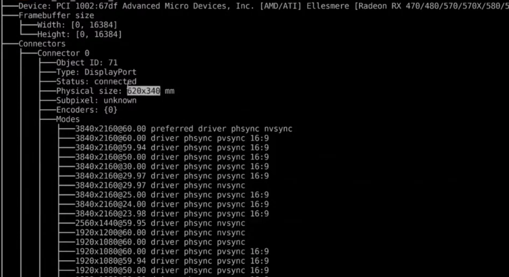

We can see this connector supports a lot of modes, from 720P to 4k modes.
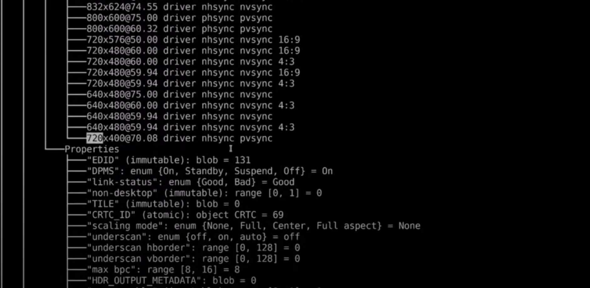

There is refresh right here in hertz. It's pretty important to say that the refresh rate is fixed and cannot be changed. Also if you want to switch from one mode to another screen, we will probably get a black screen a few seconds during the mode set operation. We don't want to do that a lot because it that's not very good user experience.
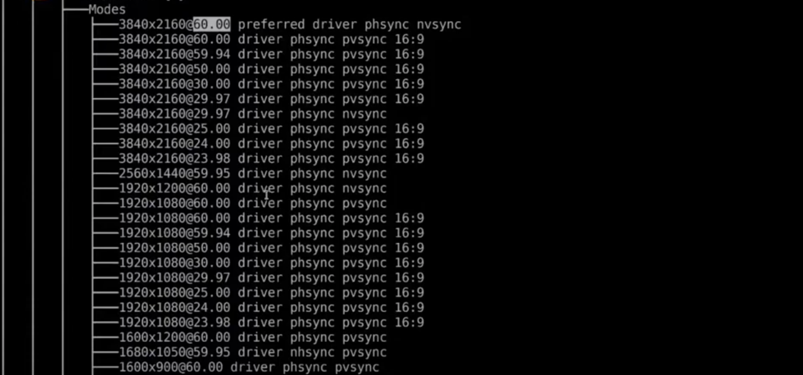

Let's write a little **KMS** client that just lists all the modes supported by the connectors.

```c
#include <fcntl.h>
#include <stdio.h>
#include <xf86drmMode.h>

int main(int argc, char **argv)
{
    int drm_fd = open("/dev/dri/card0", O_RDWR | O_NONBLOCK);
    if (drm_fd < 0) {
        perror("open failed");
        return 1;
    }

    drmModeRes *resources = drmModeGetResources(drm_fd);
    for (int i = 0; i < resources->count_connectors; i++) {
        uint32_t conn_id = resources->connectors[i];
        drmModeConnector *conn  = drmModeGetConnector(drm_fd, conn_id);
        if (conn->connection != DRM_MODE_CONNECTED) {
            return;
        }
        printf("Modes for connector %u:\n", conn->connector_id);
        for (int i = 0; i < conn->count_modes; i++) {
            drmModeModeInfo *mode = &coonn->modes[i];
            printf("%d%d %dHz\n", mode->hdisplay, mode->vdisplay, mode->vrefresh);
        }

        drmModeFreeConnector(conn);
    }
    drmModeFreeResources(resources);

    return 0;
}
```

So we can get a use of `drmModeGetConnector` function, then check the connection whether is connected if something if plugged to the connector. Then print the list of modes.

### 2.4 Framebuffers

```c
typedef struct {
    uint32_t fd_id;
    uint32_t width, height;
    uint32_t pitch;
    uint32_t bpp;
    uint32_t depth;
    uint32_t handle; /*driver specific handle*/
} drmModeFB;
```

Frame buffers are basically how we are going to display on screen and it is a slice of memory containing pixels.

- So frame before we have an object IDs -> `fd_id`, they also have a `width` and a `height`.
- This `pitch` here it is also sometimes called the stride, it's the number of bytes in each row of pixel.
- The `bbp` is the bits per pixel, or the number of bits for each pixel.
- The `handle` for each frame buffer is separate from the frame buffer ID, and it will be used to import a frame buffer into **KMS**, because **KMS** can't directlly allocate buffers, so we need to use other stuff called `handle` to import the frame buffer into **KMS** by using the `fd_id`.

### 2.5 DRM formats

Describes how pixel are laid out in the buffer.

List in `/usr/include/libdrm/drm_fourcc.h`

**XRG88888** and **ARG88888** are likely supported

Example: #112233 (R=0x11, G=0x22, B=0x33, A=0xFF)

- **ARGB8888**: {0x33, 0x22, 0x11, 0xFF}
- **BGR88888**: {0xFF, 0x11, 0x22, 0x33}

More complicated formats: **XRGB2101010**, **YUYV**, **NV12**

How do we interpret **ARGB8888**? The first part **ARGB** describes the order in which the components are laid out in memory, and the second part **88888** describes how many bits per components there are.

So here we start with the **A** component with **8** bits (**A**RGB**8**888), then the **red** component with **8** bits, the **green** component with **8** bits, and the **blue** component with **8** bits.

But you may notice that the **A** component is listed at the end, because there's a little good show, **DRM** formats are expressed in little-endian, so you basically need to read them back here to store the bytes in memory.

So we need to start with **B** -> 0x33, **G** -> 0x22, **R** -> 0x11, and **A** -> 0xFF. We need to be a little bit carefule about this.

Alos other formats like **OpenGL** formats are big-endian, so we need to have a mapping table which takes care of the mapping from **DRM** formats to **OpenGL** formats. d d

There are also some more complicated formats, for instance **XRGB2101010**. **X** means some bytes are not used. Here we have two bits at the beginning that are not used. Then 10 bits for **R** and 10 bits for **G** and **B**.

### 2.6 Allocating a framebuffer

```c
// Allocate a buffer and get a driver-specific handle back
struct drm_mode_create_dumb create = {
    .witdh = width,
    .height = height,
    .bpp = 32,
};
drmIoctl(drm_fd, DRM_IOCTL_MODE_CREATE_DUMB, &create);
uint32_t handle = create.handle;
uint32_t stride = create.pitch;
uint32_t size = create.size;

// Create the DRM framebuffer object
uint32_t handles[4] = { handle };
uint32_t strides[4] = { stride };
uint32_t fb_id = 0;
drmModeAddFB2(drm_fd, width, height, DRM_FORMAT_XRGB88888,
    handles, strides, offsets, &fb_id, 0);

// Create a memory mapping
struct drm_mode_map_dump_map = { .handle = handle };
drmIoctl(drm_fd, DRM_IOCTL_MODE_MAP_DUMP, &map);
void *data = mmap(0, size, PROT_READ | PROT_WRITE, MAP_SHARED, drm_fd, map.offset);
```

To allocate a dump buffer, we call it dump buffer this way because they are pretty simple. Pretty inefficient but pretty simple, so we're going to start with that.

We are going to perform manually a `Ioctl` called `DRM_IOCTL_MODE_CREATE_DUMB`, we are going to pass the width and the height of the frame buffer that we want to `create`. And also the bits per pixel so if we want to use the `DRM_FORMAT_XRGB88888`, then the `bbp` is 32.

Once we've performed this `Ioctl`, we get back a `handle`, a `strike`, and a `size`. We are going to use all of these information later and we can see that the `handle` here can be used to import the frame buffer into **KMS**.

Then the importing to **KMS** is done with `drmModeAddFB2()` function. It gives back a `&fb_id` which we will be able to use this object later on to configure the screen to display it.

Now we have allocated the frame buffer and imported it into **KMS**, but the frame buffer is empty or has undefined contents, so we need to write into the frame buffer to paint everything in red.

So we are going to use an `Ioctl`(`drmIoctl`) called `DRM_IOCTL_MODE_MAP_DUMP`, this is your `Ioctl` takes a `handle` and gives back an `map.offset` which can be used in a map call with the `drm_fd`. End of result is that we get a data pointer which is slice of memory we can just write into like any other memory. Just swipe pixels and then they will be copied to the GPU automatically.

Then we can use the buffer to paint it in red by writing into the data poiter, and also we have a `fb_id`. How can we use this `fb_id` to display something?

### 2.7 Planes and CRTCs: Why existing?

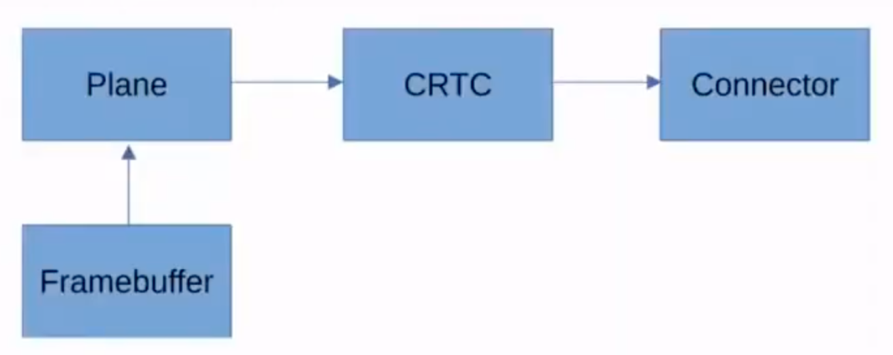

Planes and CRTCs are two other types of **KMS** objects, and basically the pixels will flow from the **Framebuffer** to the **Plane**, then to the **CRTC**, then to the **Connector** (the actual screen).

Why do we have these two extra objects? Why can't it be more simple? Why can't the pixel fall directly from the **Framebuffer** to the **Connector**?

**2 connectors wired up to a single CRTC: "clone screens"**

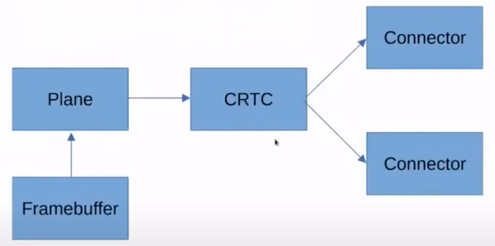

So the reason why crtc's exists is that we have a feature called the "clone screens". In some cases it's possible to use the same crtc connected to multiple connectors, so the pixels from the the frame buffer to the plane and then the crtc and then the image is duplicated and both connectors.

Don't pay too attention to the name **CRTC**, it comes from **CRT** cathode way that catered away tube, but the name is meaningless nowadays it's just there for historical reasons.

**2 planes wired up to a single CRTC: show multiple framebuffers**

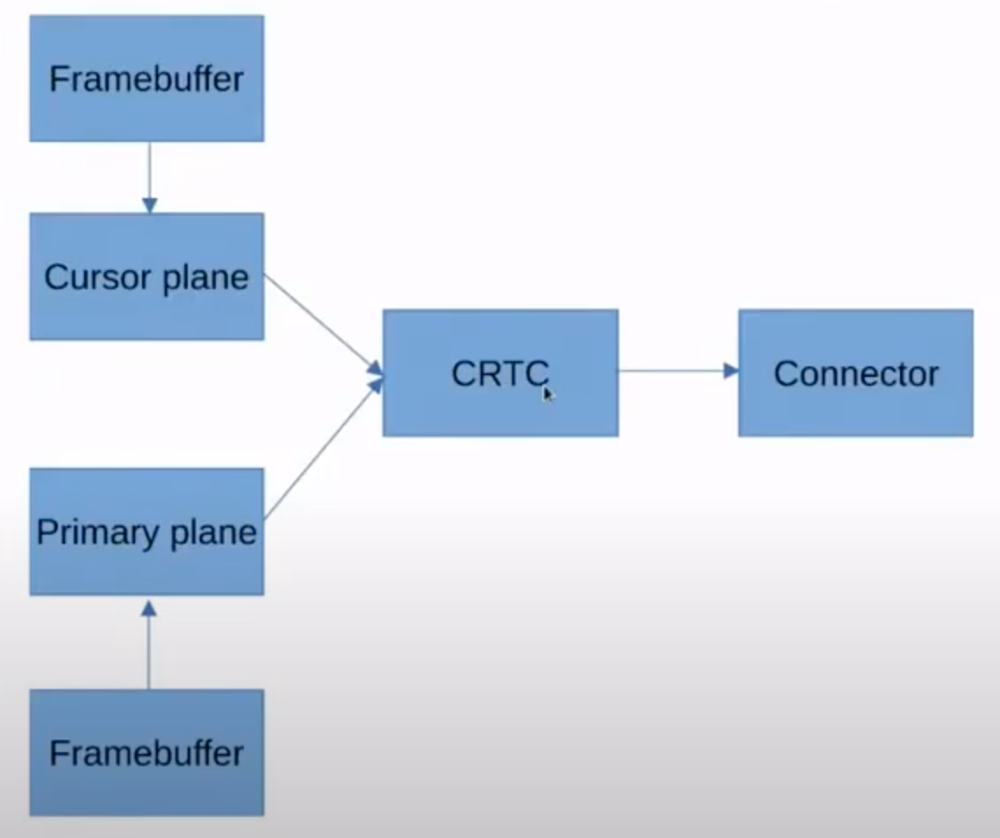

The reason of planes existing is that some GPUs can display multiple frame buffers on a single **CRTC**.

### 2.8 CRTCs

Just like connectors we can get more information about CRTCs with `drmModeGetCrtc` function wihch takes on object id - `crtc_id`, and gives back this `drmModeCrtc` structure.

```c
drmModeCrtc *crtc = drmModeGetCrtc(drm_fd, crtc_id);
```

```c
typedef struct {
    uint32_t crtc_id;
    uint32_t buffer_id; /* FB id to connect to, 0 = disconnecte */

    uint32_t x, y; /* Position on the framebuffer */
    uint32_t width, height;
    int mode_valid;
    drmModeModeInfo mode;

    int gamma_size; /* Number of gamma stops */
} drmModeCrtc;
```

The `drmModeCrtc` structure has a buch of information like the mode currently used on the CRTC - `drmModeModeInfo`.

### 2.9 Planes

```c
drmSetClientCap(drm_fd, DRM_CLIENT_CAP_UNIVERSAL_PLANES, 1);
drmModePlaneRes *planes = drmModeGetPlaneResources(drm_fd);
for (uint32_t i = 0; i < planes->count_planes; i++) {
    uint32_t plane_id = planes->planes[i];
    drmModePlane *plane = drmModeGetPlane(drm_fd, plane_id);
}
```

The first thing we need to do of using planes is to set a client capability, the `DRM_CLIENT_CAP_UNIVERSAL_PLANES` is just to say to **KMS**: "hey, I'm not a legacy client, I support the new APIs, so don't worry about me." And then **KMS** will let us use other planes.

We can use `drmModeGetPlaneResources()` function to get the list of planes,
we get a list of plane IDs, and we can use `drmModeGetPlane()` function to get plane structure.

```c
typedef struct {
    uint32_t count_formats;
    uint32_t *formats;
    uint32_t plane_id;

    uint32_t crtc_id;
    uint32_t fb_id;

    uint32_t crtc_x, crtc_y;
    uint32_t x, y;

    uint32_t possible_crtcs;
    uint32_t gamma_size;
} drmModePlane;
```

The most interesting field is probably the formats array - `uint32_t *formats`, it describes all the **DRM** formats supported by our plane.

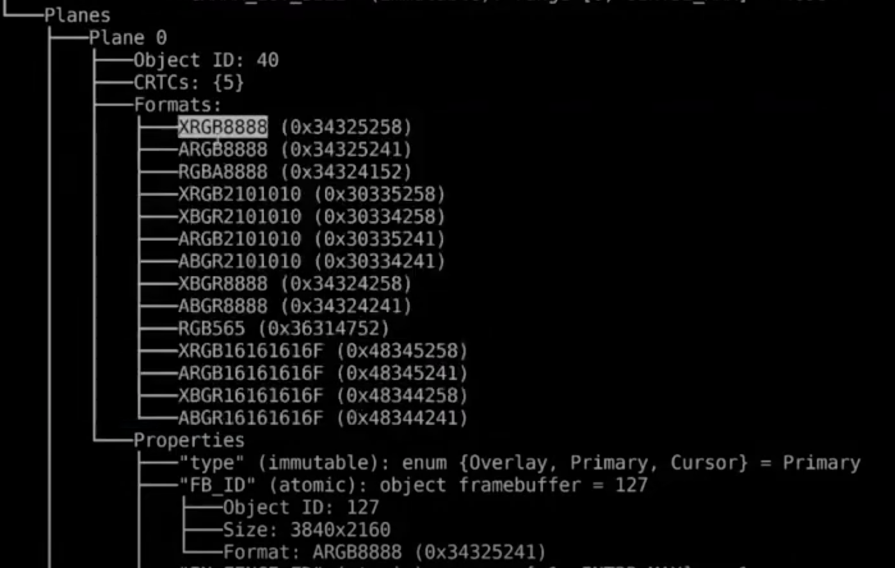

### 2.10 Object properties

We have discussed about reading the **DRM** objects like `drmModeConnector`, `drmModeFB`, `drmModeCrtc` and `drmModePlane`, but how can we modify it.

```c
drmModeObjectProperties *props = drmModeObjectProperties(drm_fd, crtc_id, DRM_MODE_OBJECT_CRTC);
for (uint32_t i = 0; i < props->count_props; i++) {
    uint32_t prop_id = props->props[i];
    drmModePropertyRes *prop = drmModeGetProperty(drm_fd, prop_id);
}
```

**KMS** exposes objects which have an ID and a type, but these objects also have properties. We can list the properties with `drmModeObjectProperties()`, we just provide the object id - `crtc_id` and the object type `DRM_MODE_OBJECT_CRTC`, and it gives a list of properties.

```c
typedef struct {
    uint32_t count_props;
    uint32_t *props;
    uint64_t *prop_values;
} drmModeObjectProperties;

typedef struct {
    uint32_t prop_id;
    uint32_t flags;
    char name[DRM_PROP_NAME_LEN];
    int count_values;
    uint64_t *values; /* store the blob lengths */
    int count_enums;
    struct drm_mode_property_enum *enums;
    int count_blobs;
    uint32_t *blob_ids; /* store the blob IDs */
} drmModePropertyRes;
```

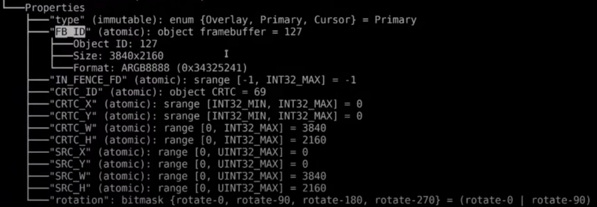

### 2.11 Reading a property

`selectres.c`

```c
/*
* Select KMS resources
*
* This demo reads the current KMS  configuration and retrieves
*
*   The first CRTC currently lighted on
*   The mode used by the CRTC
*   The primary plane connected to the CRTC
*/

#include <assert.h>
#include <fcntl.h>
#include <stdio.h>
#include <stdlib.h>
#include <string.h>
#include <xf86drm.h>
#include <xf86drmMode.h>

drmModeCrtc *crtc = NULL;
drmModeModeInfo mode - {0};
drmModePlane *plane = NULL;

uint64_t get_property_value(int drm_fd, uint32_t object_id, uint32_t object_type, const char *prop_name) {
    drmModeObjectProperties *props = drmModeObjectGetProperties(drm_fd, object_id, object_type);

    for (uint32_t i = 0; i < props->count_props; i++) {
        drmModePropertyRes *prop = drmModeGetProperty(drm_fd, props->props[i]);
        uint64_t val = props->prop_value[i];
        if (strcmp(prop->name, prop_name) == 0) {
            drmModeFreeProperty(prop);
            drmModeFreeObjectProperties(props);
            return val;
        }
        drmModeFreeProperty(prop);
    }
    abort();    // Oops, property not found
}

int main(int argc, char **argv) {
    int drm_fd = open("/dev/dri/card0", O_RDWR | O_NONBLOCK);
    if (drm_fd < 0) {
        perror("open failed");
        return 1;
    }

    if (drmSetClientCap(drm_fd, DRM_CLIENT_CAP_UNIVERSAL_PLANES, 1) != 0) {
        perror("drmSetClientCap(UNIVERSAL_PLANES) failed");
        return 1;
    }

    drmModeRes *resources = drmModeGetResources(drm_fd);

    // Get the firs CRTC currently lighted up
    for (int i = 0; i < resources->count_crtcs; i++) {
        uint32_t crtc_id = resources->crtcs[i];
        crtc = drmModeGetCrtc(drm_fd, crtc_id);
        if (crtc->mode_valid) {
            break;
        }
        drmModeFreeCrtc(crtc);
        crtc = NULL;
    }

    assert(crtc != NULL);
    printf("Using CRTC %u\n", crtc->crtc_id);

    mode = crtc->mode;
    printf("Using mode %dx%d %dHz\n", mode.hdisplay, mode.vdisplay, mode.vrefresh);

    // Get the primary plane connected to the CRTC
    drmModePlaneRes *planes = drmModeGetPlaneResources(drm_id);
    for (uint32_t i = 0; i < planes->count_planes; i++) {
        uint32_t plane_id = planes->planes[i];
        plane = drmModeGetPlane(drm_fd, plane_id);
        uint64_t plane_type = get_property_value(drm_fd, plane_id, DRM_MODE_OBJECT_PLANE, "type");
        if (plane->crtc_id == crtc->crtc_id && plane_type == DRM_PLANE_TYPE_PRIMARY) {
            break;
        }
        drmModeFreePlane(plane);
        plane = NULL;
    }
    assert(crtc != NULL);
    printf("Using plane %u\n", plane->plane_id);

    drmModeFreePlaneResources(planes);
    drmModeFreePlaneResources(resources);

    return 0;
}
```

### 2.12 Atomic commits

Why is atomic there?

Because we could just be a function that just sets the frame buffer to the one we want.

That's how the lagecy API worked, but it had a few issues. For instance if wanted to update the cursor plane, when I move the mouse, it moves and it can change the cursor icon also. The compositor may want to do both at the same time.

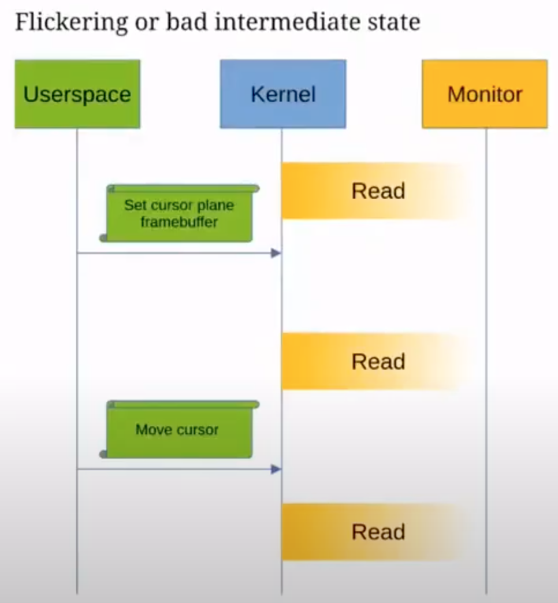

When using the lagecy API, there was one `ioctl` request to set the cursor plane frame buffer, and another request to move the cursor. So the will do one and then the other issue is that the monitor reads at a very fixed refresh rate. The **CRTC** image (**CRTC** output), what might happen is that the compositor sets the cursor plnae frame buffer, then the monitor reads the image, and then the compositor moves the cursor. And it ended up in the situation where the cursor hasn't moved yet but has already changed the image.

It might not be a big issue for cursors because it's not that important for cursors but you see that there are a lot of over other object properties. So if you want to change a lot of properties at once, you might end up in a bad state. A state where part of the image is new and part of the image is the previous image.

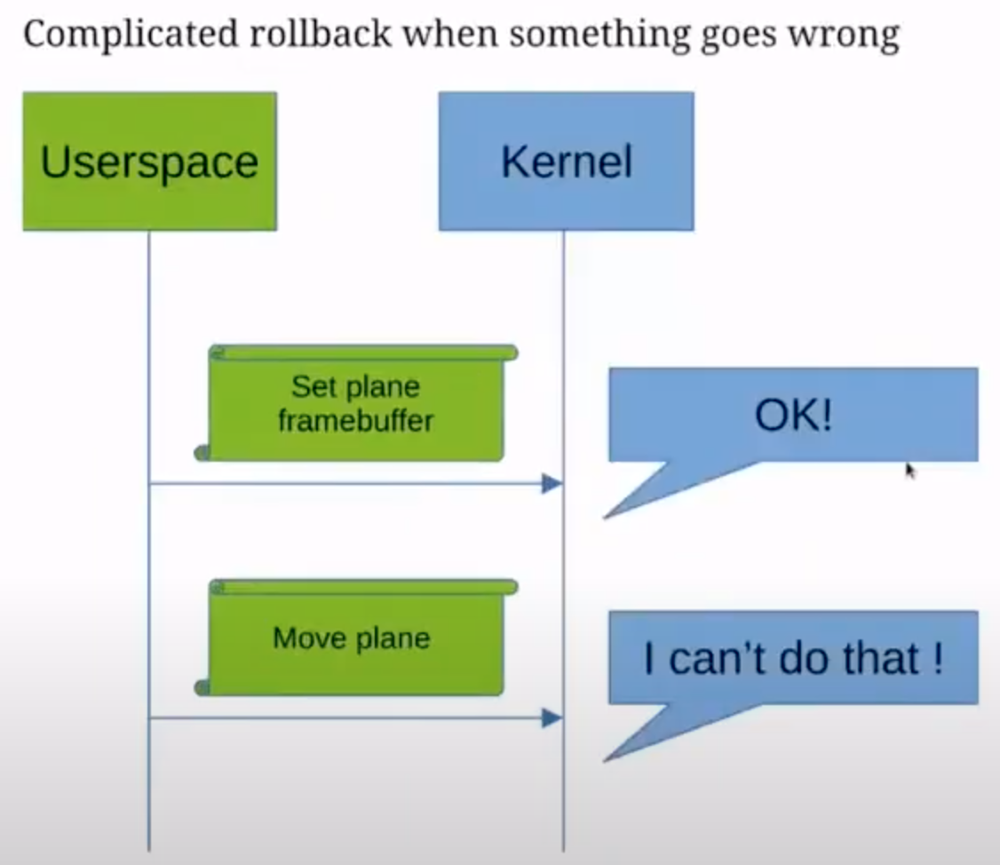

Another issue with legacy APIs so having two requests (or multiple requests) to change each property. Sometimes **KMS** can say the GPU is not capable of doing something. So for instance if we set the plane frame buffer, **KMS** might say okey that's fine, and then after if we try to move the plane, **KMS** might say I can't do that.

Then if we are in the position of the userspace here, it is a little bit tricky because we need to fall back, and we need to handle this request gracefully.

But already else we have set half of the state, but half of the states could not be set. So we nned to hold back the plane from buffer to the previous one and then try to do something else.

That's pretty involved, when something goes wrong, it's not easy to rollback to the previous configuration.

So atomic commits should fix this by providing a request to set multiple properties at once in an atomic fashion.

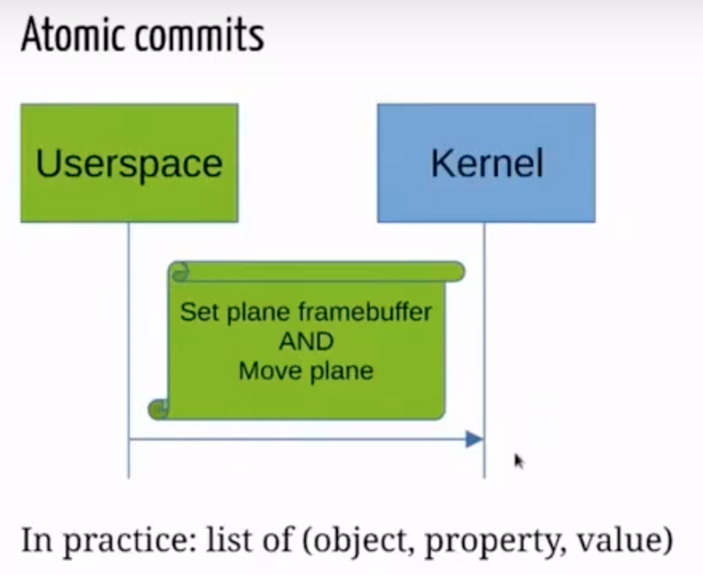

A request to set the plane frame buffer and move the plane at the same time -> this fixes both issues.

In practice, atomic commits list of properties to certain objects. on this object we want to say `fb_id` to this value, and we can add a bunch of this.

### 2.13 Setting a property

How do we do that in codes?

```c
drmSetClinetCap(drm_fd, DRM_CLIENT_CAP_ATOMIC, 1);

drmModeAtomicReq *req = drmModeAtomicAlloc();
drmModeAtomicAddProperty(req, object_id, prop_d, value);
// Add more properties.

drmModeAtomicCommit(drm_fd, req, flags, NULL);
```

The first thing we need to do is to set the atomic capbility, to say to kernel: "hey, I support the atomic interface, not it for legacy things."

Then allocate something called an atomic request and we will be able to add multiple properties to this request, for instance on `object_id` for the plane, the `prop_id` for the `fb_id` property, the `value` is to the `fb_id` we allocated earlier.

We can add more bunches properties here.

At the end when we have done adding all the properties, we will submit everything at once with (`drmModeAtomicCommit()`) **DRM** mode atomic commits which take the requests and a few flags.

A helper code:

```c
void add_property(int drm_fd, drmModeAtomiReq *req, uint32_t object_id, uint32_t object_type, const char *prop_name, uint64_t value) {
    uint32_t prop_id = 0;
    drmModeObjectProperties *props = drmModeObjectProperties(drm_fd, object_type);
    for (uint32_t i = 0; i < props->count_props; i++) {
        if (strcmp(prop->name, prop_name) == 0) {
            prop_id = prop->prop_id;
            break;
        }
    }
    assert(prop_id != 0);

    drmModeAtomicAddProperty(req, object_id, prop_d, value);
}
```

### 2.14 Display a buffer

```c
drmModeAtomicReq *req = drmModeAtomicAlloc();

add_property(drm_fd, req, plane_id, DRM_MODE_OBJECT_PLANE, "FB_ID", fb_id);
add_property(drm_fd, req, plane_id, DRM_MODE_OBJECT_PLANE, "SRC_X", 0);
add_property(drm_fd, req, plane_id, DRM_MODE_OBJECT_PLANE, "SRC_Y", 0);
add_property(drm_fd, req, plane_id, DRM_MODE_OBJECT_PLANE, "SWC_W", width << 16);
add_property(drm_fd, req, plane_id, DRM_MODE_OBJECT_PLANE, "SRC_H", height << 16);
add_property(drm_fd, req, plane_id, DRM_MODE_OBJECT_PLANE, "CRTC_X", 0);
add_property(drm_fd, req, plane_id, DRM_MODE_OBJECT_PLANE, "CRTC_Y", 0);
add_property(drm_fd, req, plane_id, DRM_MODE_OBJECT_PLANE, "CRTC_W", width);
add_property(drm_fd, req, plane_id, DRM_MODE_OBJECT_PLANE, "CRTC_H", height);

uint32_t flags = DRM_MODE_ATOMIC_NONBLOCK;
int ret - drmModeAtomicCommit(drm_fd, req, flags, NULL);
if (ret != 0) {
    perror("drmModeAtomicCommit failed");
    return 1;
}
```

Besides adding `fb_id` property, actually we need to add a few other properties as well. These other properties are `SRC` - source rectangle and `CRTC` - destination rectangle.

The source rectangle `SRC` is set with the four properties here, the source rectangle is to used crop a buffer so if you want to have a frame buffer, and only display a subset of it, you are going to set the source coordinates to a rectangle smaller than the full buffer. You need to shift the width and the height for 16 bits here because the source rectangle is given in a fixed point coordinates.

The other thing we need to do is to set the destination rectangle, this allows to scale with a frame buffer. If we have a small frame buffer, and we want to scale it to be larger, we can do that with the destination rectangle. Here just like the source rectangle, we are going to set it to the full frmae buffer.

We have set the `flags` as `DRM_MODE_ATOMIC_NONBLOCK` because we are not interested in waiting for the frame buffer to be displayed on screen or anything. Then just to perform the atomic commits.

## 3. Goodies

### 3.1 Encoders

All CRTCs are not compatible with all connectors, so we need encoders.

```c
typedef struct {
    uint32_t encoder_id;
    uint32_t encoder_type;
    uint32_t crtc_id;
    uint32_t possible_crtcs;
    uint32_t possible_clone;
} drmModeEncoder;
```

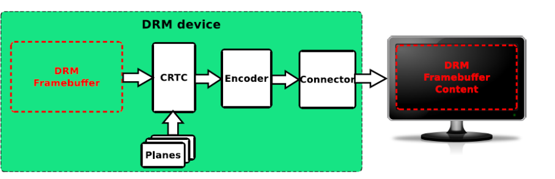

### 3.2 Picking a CRTC and an encoder

```c
uint32_t pick_crtc(int drm_fd, drmModeRes *res, drmModeConnector *conn) {
    // Build a bitmask for all CRTCs we can use for this connector
    uint32_t possible_crtcs = 0;
    for (int i = 0; l < conn->count_encoders; i++) {
        drmModeEncoder *enc = drmModeGetEncoder(drm_fd, conn->encoders[i]);
        possible_crtcs |= enc->possible_crtcs;
        drmModeFreeEncoder(enc);
    }
    assert(possible_crtcs != 0);

    for (int i = 0; i < res->count_crtcs; i++) {
        // Check the CRTC is compatible with the connector
        uint32_t crtc_bit = 1 << i;
        if ((possible_crtcs & crtc_bit) == 0) {
            continue;
        }
        return res->crtcs[i];
    }
    abort(); // Oops, didn't find any suitable CRTC
}
```

### 3.2 Page-flip evnets

Perform atomic commits with the `DRM_MODE_PAGE_FLIP_EVENT` flag.

```c
// Define a page flip callback
void handle_page_flip(int drm_fd, unsigned int se, unsigned int tv_sec, unsigned int tv_usec, unsigned int crtc_id, void *data) {
    printf("Got a page-flip event for CRTC %u!\n", crtc_id);
}

while (true) {
    // Wait for a DRM event
    struct pollfd fds[] = {
        { .fd = drm_fd, .events = POLLIN },
    };
    nfds_t fds_len = 1;
    poll(fds, fds_len, -1);
    assert((fds[0].events & POLLIN) != 0);

    // Read the DRM event
    drmEventContext context = {
        .version = 3,
        .page_flip_handle2 = handle_page_flip,
    };
    drmHadledEvent(drm_fd, &context);
}
```

### 3.3 Double-buffering

- Allocate two buffers: a back-buffer and a front-buffer
- Write to the back-buffer while the kernel uses the front-buffer
- Synchronize writes with page-flip events
- Swap buffers when we're doing writing

### 3.4 Hotplug events

```c
// Create a udev monitor
struct udev *udev = udev_new();
struct udev_monitor *monitor = udev_monitor_new_from_netlink(udev, "udev");
udev_monitor_filter_add_match_subsystem_devtype(monitor, "drm", NULL);
udev_monitor_enable_receiving(monitor);

while (true) {
    // Wait for a udev event
    struct pollfd fds[] = {
        { .fd = udev_monitor_get_fd(monitor), .events = POLLIN },
    };
    nfds_t fds_len = 1;
    poll(fds, fds_len, -1);
    assert((fds[0].events & POLLIN) != 0);

    // Receive a udev event
    struct udev_device *dev = udev_mointor_receive_device(monitor);
    const char *action = udev_device_get_action(dev);
    if (action != NULL && strcmp(action, "change") == 0) {
        printf("Got udev change event for device %s\n", udev_device_get_sysname(dev));

        // Reload KMS state
    }
}
```

### 3.5 Test-only atomic commits

Allows to check hardware capabilities

```c
uint32_t flags = DRM_MODE_ATOMIC_TEST_ONLY;
int ret = drmModeAtomicCommit(drm_fd, req, flags, NULL);
if (ret == -EINVAL || ret == -ERANGE) {
    printf("Hardware doesn't support this configuration\n");
} else if (ret == 0) {
    printf("Hardware does support this configuration\n");
} else {
    perror("drmModeAtomicCommit failed");
}
```

### 3.6 OpenGL integration: display creation

```c
struct gbm_device *gbm_device = gbm_create_device(drm_fd);

// Create a new EGL display (require EGL_KHR_platform_gbm)
EGLDisplay egl_display = eglGetPlatformDisplay(EGL_PLATFORM_GBM_KHR, gbm_device, NULL);
```
