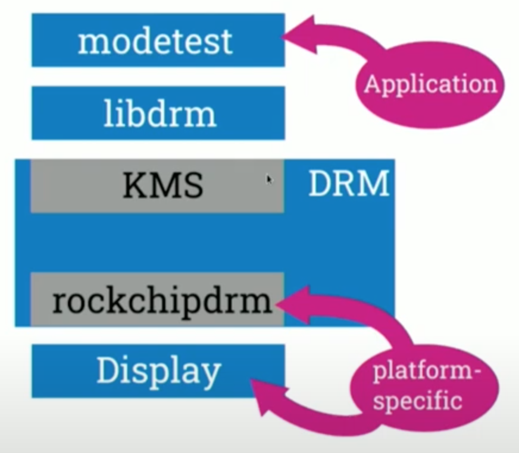
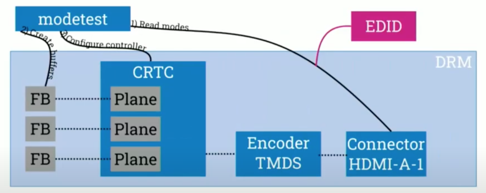
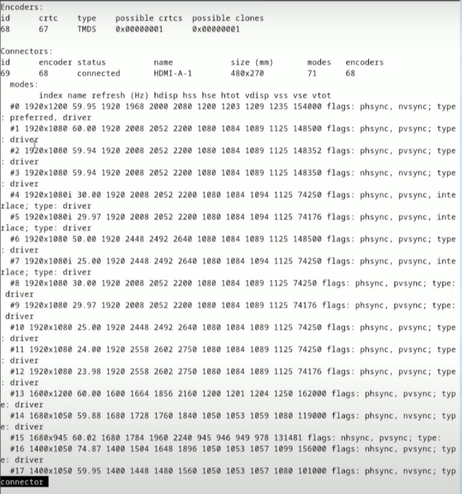
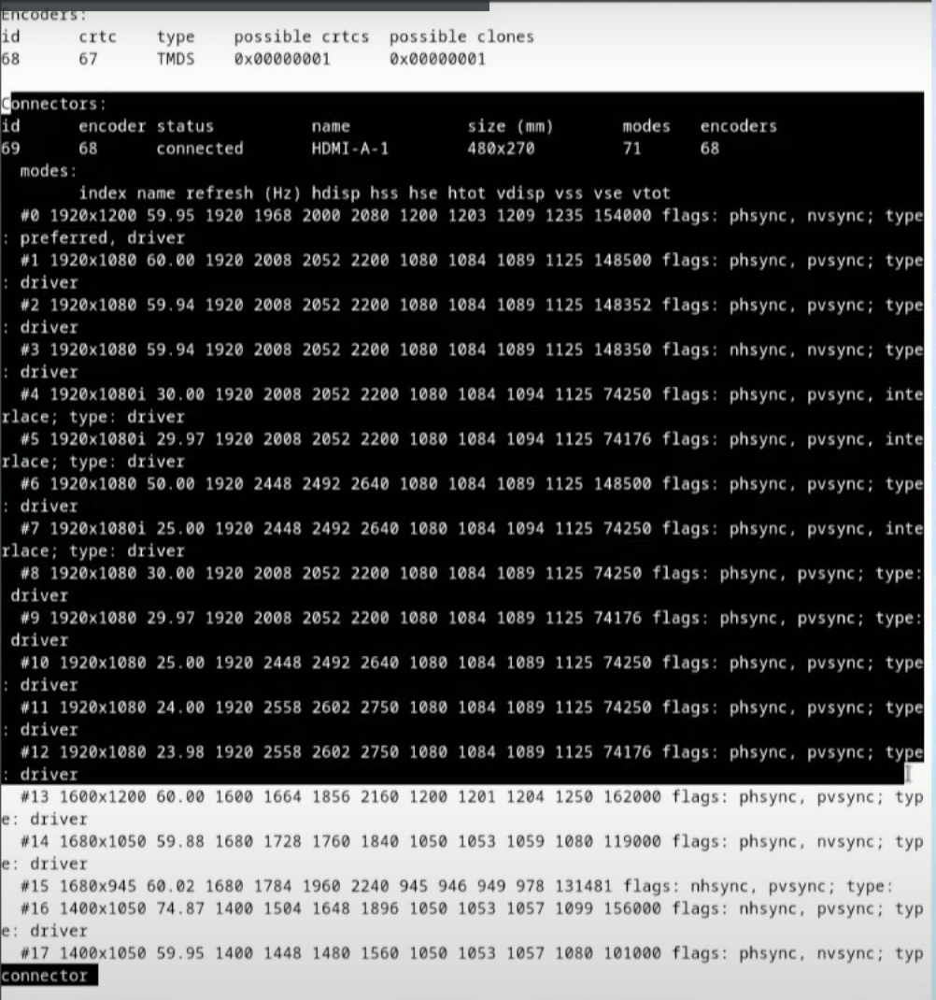
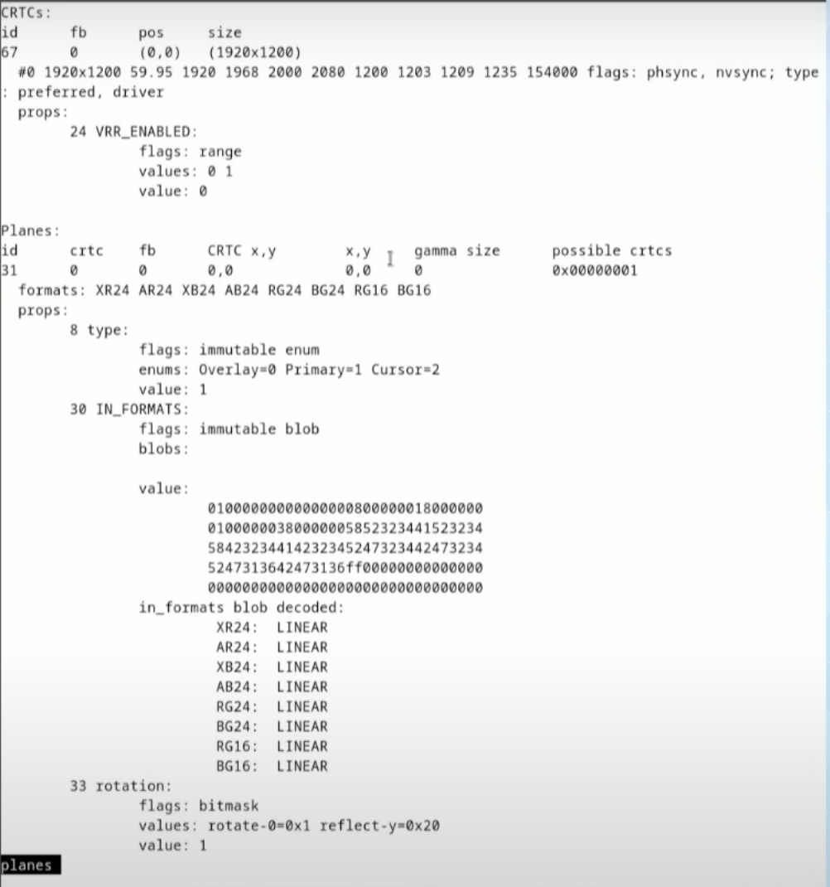
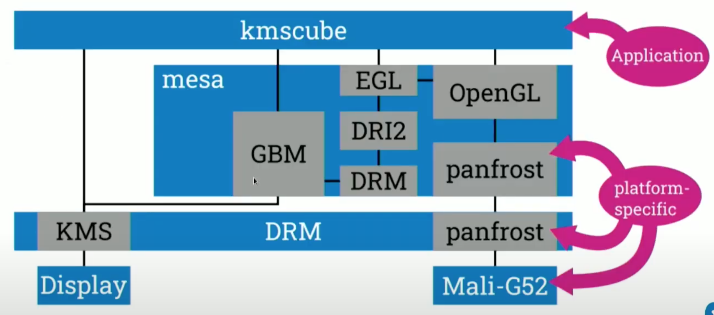
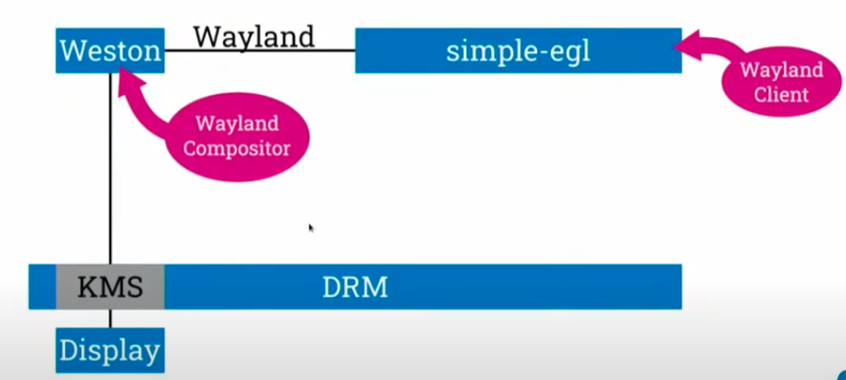
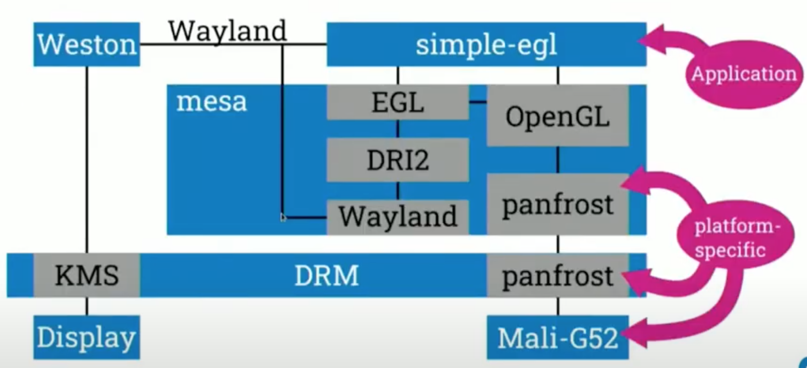
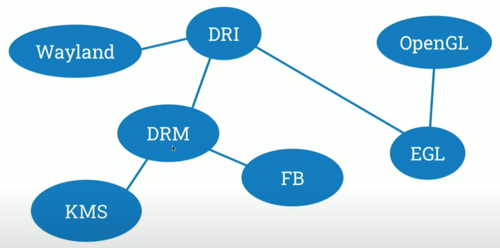

# Linux Graphics Stack Basic

## Bring a Pixel Buffer onto the Display

### Applications draw pixels into pixels buffer

Application first draws pixels into some buffer so it's some memory and it puts them as RGB or nv12 so in some specified format describes the color of each pixels.

For example it may just go through the each line of this buffer and put the color once there.

### Pixel buffer must be sent to display controller

Then this pixcel buffer must be sent to the display controller which is responsible for drivin the display.

### Display must be configured for pixel buffer

And the display must be configred to correctly interpret the data for the display such as the color format the size and this drive which means how long are the lines of this buffer.

All of this has to be configured in the display ocntroller to correctly interpret the otherwise meaningless data.

### Display - Acronyms

- DRI - Direct Rendering Infrastructure
- DRM - Direct Renderring Manager
- KMS - Kernel Mode setting
- FB Frame Buffer



- **DRM** as the kernel component
- **libdrm** provides MC helpers for interacting with kernel
- An application example output from **modetest** which allows you to look inti the DRM driver for driving the display especially KMS and what it provides to you
- In **DRM** we have a set the display and the display controller, drive of the display are usually part of the SoC, so these are platform dependent.
- The display controller and you have some part in the **DRM** driver which is also responsible for driving exactly this display controller
  - So it has to be platform dependent as well more exactly it depends on the display controller.
  - So you might have the same display controller on different SoCs but consider it as platform specific.
- **KMS** is the interface to the user space and for driving the display and drm.

### _libdrm:modetest_

```sh
modetest -M rockchip
modetest -M rockchip -a -s 69:1920x1080
```



The **modetest** is a tool to set a mode via **KMS** on the display, but it also provides you infomation about the display controller that connected to the dispaly, etc. Otherwise it could we wouldn't be able to set valid modes.

```sh
less connector
```



On top we see the encoders, this is some oudated construct which is user exposed to space so we cannot get rid of that but we will ignore it.



- HDMI connector
- Edit of the display to find out which modes are supported
- The display conneted as 1920 x 1200 pixel size or full HD with different frame rates


```sh
less planes
```



The more interesting part form a software perspective are the **CRTC**. The **CRTC** is an abstraction for the display conntroller itself. So display controllers may compose a different planes and build the final buffer that's sent to the display.

You configure the **CRTC** to build the buffer that's sent out.

In the top we see that we configured a mode already, so the one with the highest resolution.

And we have various planes that are composed by the CRTC or the display controller with different pixel formats.

So here you have to configure the planes and the crtz according to the data you want to show on your display.

As a finall step to actually put data **_[in_formats blob decoded]_** you have to allocate this Frame Buffers with FPS. And in your configuration you tell your display controller: "okey, take this frame buffer, put it on this plane and show it."

### Kernel Debugging

```sh
ls /sys/class/drm/card0-HDMI-A-1
ls /sys/kernel/debug/dri/0
echo 0x1ff > /sys/module/drm/parameters/debug
```

**DRM** is a kernel module, so you have futher debugging information about the kernel module available via the **CSFS** and the debug FS, so you'll find in the path shown above.

More information about the connection status you can read and edit there as well. So this is the information exposed by the kernel without going through **modetest** or some user space component.

For debugging the kernel you have some specialty in **DRM** so you have a parameter which is called debug to enable different flags for debugging **DRM** driver.

There we enable all the flags but check the **DRM** driver in the kernel for the meaning of each flag so you can have a more fine-grained configuration of that.

## Draw pixels into a pixel buffer

That's how we bring the pixels to the display. As a next step, we want to draw pixels into the buffer that we sent out to the display.

### Drawing each pixel with CPU can be slow

Doing this with the CPU and going by each pixel can be really slow and for running at higher frame rates. We have deadlines for each buffer when it has to be finished so this might work, but for higher resolution it usually doesn't.

### Copying frames by fixel can be slow

Also copying frames but pixels on the CPU can be slower it's just more or less the same as drawing, because you have to take it from one buffer put it to the other, and write it through all your caches and this might take some time.

### Pixels can be drawn by hardware accelerators

So that's usually why there are hard accelerators for writing pixels to a buffer. So all these writing and drawing of a picture is a hardware accelerated.

### GPU - Acronyms

The API to applications for using hardware accelerators which are being used GPUs as a term for that. So it's graphics processing units these are usually the other accelerators.

- **OpenGL** - Open Graphics Library
- **GLSL** - OpenGL Shading Language
- **EGL** - Native Platform Graphics Interface API

**OpenGL** is the API to applications, so applications use **OpenGL** to do some rendering, that's currently the case there is **OpenGL** is more or less deprecated and superseded by **Volcan** but it's not that broadly used yet. So we will be focusing on **OpenGL**.

**GLSL** is the shading language, so you write some shaders for what the GPU should do, and you write this shader programs in a **GSL**.

**EGL** is the interface between **OpenGL** and your native platform graphics interface.

### GPU Stack



The application has to get the buffer that's put on the display on some way that's **GBM**. So it can take a frame buffer that's allocated by a **KMS** and wrap it into a **GBM** object, that's just some more or less internal representation.

This **GBM** object further goes through, some **DRM** component in so everything of that is implemented in miso.

Goes through some **DRM** component which is especially for interacting with **KMS** or **DRM** drivers. And interface that's called **DRI** tool. Don't be confused with direct rendering interface which is the overall thing but it's the same an implementation. It's difficult with the naming but this is an implementation of an internal inferface.

So you get the frame buffer via **KMS**, put it through **GBM**, **DRM**, **DRI**, **EGL**, and now you have an **EGL** image that high level of representation of your frame buffer that you will put on the display. And this **EGL** image you can put to **OpenGL** and render to it with **OpenGL**.

**OpenGL** abstracts the **GPU**, the **GPU** is platform specific. Again **GPU** specifc but it might differ between your platforms.

On the Rockchip platform here the GPU is supported by the **panfrost** driver and it's a **Mali GPU**.

So this implementation of **OpenGL** is again platform specific all of that over here, is a Linux interfaces and works the same on all platforms.

### kmscube

**kmscube** is a simple application to access KMS and to use **OpenGL** to render something.

```sh
kmscube
EGL_LOG_LEVEL=debug kmscube
MESA_GLSL=dump kmscube
```

For debugging the generic via implementation you can use environment variables so for debugging what's going on in **MESA**. You might set for example **EGL lock level** so it locks what's going on in **EGL**, or you might dump the **GLSL shaders** that the application uses.

So you can look into what's the **OpenGL**'s shaders what **OpenGL** shaders look like that the application is using.

### GPU Driver Debugging (panfrost)

You can look further down into there in the platform specific part so the shaders have to be compiled to some **GPU** specific machine language for looking into what your driver is doing.

```sh
PAN_MESA_DEBUG=trace kmscube
BIFROST_MESA_DEBUG=shaders kmscube
```

You can use other environment variables they are usually prefixed with a driver name and mix a debug, then you can see raw shaders or see what optimizations the **GPU** driver is doing to your shaders for running in autumn **GPU**.

Again if you have a different platform the variables name maybe different, check the meter source usually the options and the environment variables are documented there.

## Compose multiple pixel buffers

### Only a single application may use display -> DRM master

Now we have a problem that **KMS** and the display can be only driven by a single application that's by design. Only one application can be drive the display.

And that's called **DRM master** so if you are running a second application that tries to access a DRM because you want to use a second application on a different plane.

For example you might receive permission denied error when starting the application and that's usually caused by the second application not being the DRM master.

### Toolkits and applications (often) don't support KMS

Further more toolkits like **gtkcute**, don't support direct interaction with **KMS** and applications as well, that's because most of the time it doesn't do what you actually want and if you have multiple applications it just doesn't work.

### We need a window compositor -> Wayland

Therefore we need a window compositor that takes the different applications puts them together into a single buffer and sends it out to the display. That's where a **Wayland** comes in.

**_Wayland Architecture_**

[](https://wayland.freedesktop.org/architecture.html)

- Wayland Client
- Wayland Compositor
- Wayland Protocol

In this diagram, we have a **Wayland Compositor** running on top of **KMS**, and multiple applications - the **Wayland Clients** on top of the **Wayland Compositor**.

The **Wayland Clients** and the **Wayland Compositor** interacts with each **Wayland Protocols** which are specified.

### Wayland Compositor

- Reference implementation: Weston
- Mutter(GNOME), Kwin(KDE), wlroots(sway, cage)

**Weston** is usable but not really usable for desktop use cases so you have different **Wayland Compositor** if you look into your machines, so if you use gnome you might have mutter as a compositor, with KDE you have K1 or there are various compositors on wlroots like sway and cage, so there all implementations of **Wayland Compositor**.

### Weston Overview



We have **DRM** and **KMS** in the button like wit **kmscube**, we have the **Wayland Compositor Weston** running on **KMS**, some **Wayland Client** the `simple-egl` application runing as well as interacting with
the **Wayland Compositor Weston** with the **Wayland Protocol**.

### Debugging Weston

```sh
weston --debug
weston-debug backend-drm
```

For example one debugging stream is back in **DRM** which is exactly the implementation or the component of Western that **KMS** so if you look at this stream you will see what **Weston** does with the planes that color pixel formats it sets on the planes.

And in general how **Wester** interacts with **KMS**, so if there is something strange on the display and you expecting that the **Weston** is doing something wrong by look at the debugging stream.

```sh
wayland-info
WAYLADN_DEBUG=1 simple-egl
Weston-debug proto
```

There are further tools for debugging **Wayland Info** is a client application that connects to your **Wayland Compositor**, and shows which Protocols are supported in which versions so you can use this to get information about your **Wayland Compositor** and what can be used in your application of the compositor here.

This `proto` are quite important for because the applications are using it to talk to the compositor, to look into what the application sends to the compositor and receives as responses.

You might set this wayland debug environment variable so you get all the messages that are sent between the client and the server, and see if something surprising there.

Thatis for debugging the client side so what the client is seeing you have as well a compositor which has to interact with clients as well via the protocols for debuging the server. The compositor perspective of the **Wayland Protocol**, you might use `weston-debug` again with the `proto` stream which shows you all the protocol messages that the compositor seeing. So that's useful for debugging the interaction between a **Wayland Client** and a **Wayland Server**.

### Wayland Client and EGL



We want applications to draw into **pixel buffer** as well, these are not **frame buffers** that are directly sent to the display, but are sent to the **Wayland Compositor** for compositing. So we have different pixel buffers that are later composited.

Now let's start on top, so we have a **simple-egl** which uses **OpenGL** that's the same as with **kmscube**, and the difference is that the buffers are abstracted as **EGL images** and **DRI**, but here we don't have the **DRM platform**, but now we have a **Wayland platform** on the client side.

And this **Wayland platform** instead of using **frame buffers** from **KMS** it, ut uses buffers that sent via **Wayland Protocols** to the display composer to the **Wayland Compositor**.

But for the application it almost looks the same, so everything happens down here in **mesa**, which detects you are not running on **KMS** but running as a **Wayland Client**.

### Wayland Summary



- **OpenGL**: the abstraction for using **GPUs**.
- **EGL**: to provide buffers to **OpenGL** and into which we can render.
- **DRI**: all of these is part of the direct rendering infrastructure which is overall term.
- **Wayland**: for passing buffers that are allocated from by the clients to some **Wayland Compositor** for composing it into a final buffer.
- **DRM**: as the kernel component that is the driver or current component of the **DRI** infrastructure.
- **KMS**: the display -> the part of the API that drives the display as part of **DRM**.
- **FB**: frame buffers which are the buffers that we can pass through **DRM** to a display.
