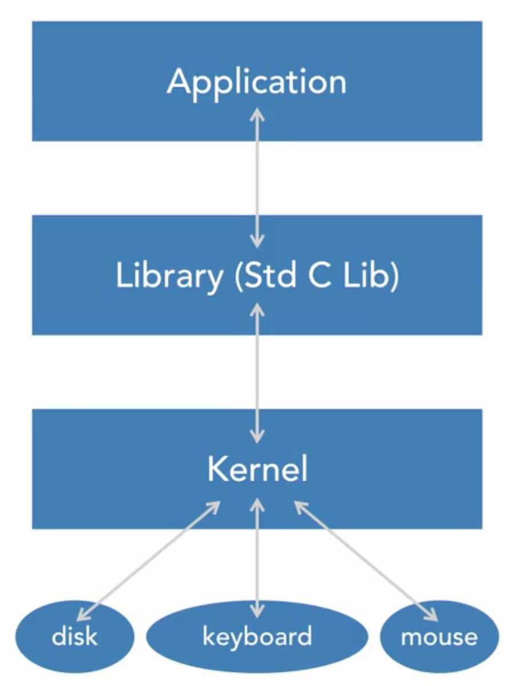
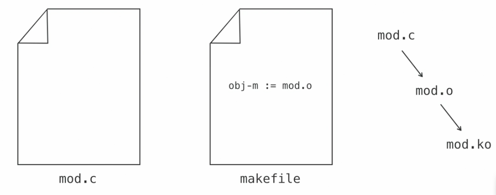
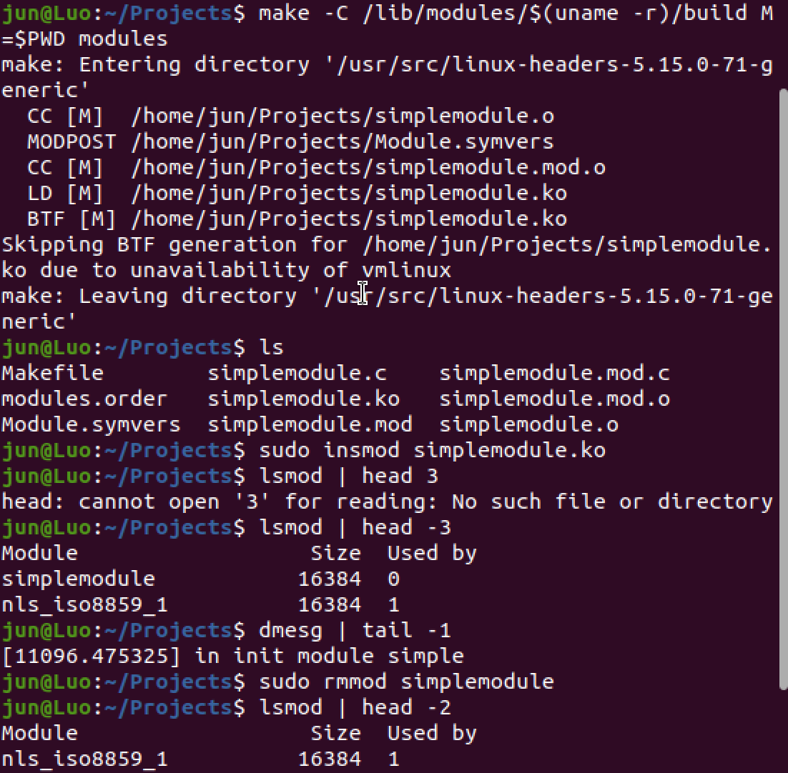

# The Linux Kernel

## 00 inux Kernel Overview

### 00-01 Prerequisites and takeways

- **What You Should know**

  - Be familiar with the Linux
  - Be familiar with C programming
  - Know how to edit files on Linux

- **The Setup**
  - Linux machine with root access availble
  - Virtual machine could be helpful (In case somethong damages happen)
  - Ensure the safety of you data befor econtinuing

### 00-02 What is Linux Kernel

- **The Kernel is a Program**

  - Often with a name link vmlinuz<KERNEL\*\*VERSION>
  - Loaded a run by a boot loader, like GRUB
  - Has command-line parameters

- **The Kernel is an API**

  - System calls
  - Virtual file system entries
    - proc
    - sys
    - deb ugfs
  - Device files (system calls)

- **The Kernel is a Gatekeeper**

  - Enforces privileges (capabilities)
  - Executes supervisor intructions
  - Implements security policies
  - Controls access to hardware and other resources

- **The Kernel is Modular**

  - Kernel image is relative small
  - Kernel image is sufficient to boot to user space
  - Optional functionality is added after booting
  - It allows for alternatives; for example, loading only divers required for present hardware

### 00-03 Where is Linux Kernel

```sh
cd /boot
```

```sh
uname -r
```

```=>
5.15.0-52-generic
```

```sh
ls -l /boot/vmlinuz-5.15.0-52-generic
```

```=>
-rw------- 1 root root 11442496 Oct 13 2022 /boot/vmlinuz-5.15.0-52-generic
```

This file will be loaded by GRUB to memory during the bootloading.

## 01 Surveying the Linux Kernel

### 01-01 Discover and Control Hardware

[Application] <-> [Library](Std C Lib) <-> [Kernel] <-> [Hardware](disk|keyboard|mouse)


- **The Software Layers to and from Hardware**

  - Applications call functions in libraries. Some of those functions invoke kernel system calls.
  - Some system calls interact with hardware

- **Commands for HW info**

  - `lshw` and `lspci`
  - `lsusb` and `lsbk`
  - `lscpu` and `lsdev`

Notes: Not all Linux distros have these commands available

- **Cmds for HW Control and Conifg**

  - `hdparm`
  - Write (e.g., `echo`) to `proc`, `dev`, or `sys files`
  - `inb` and `outb`
  - `setpci`

**_Try_**

### 01-02 Understanding System Call Mechanics

- **System Calls**

  - System calls are functions implemented by the kernel and meant to be called from user space
  - There are about 300
    - See `include/uapi/asm-generic/unistd.h`
  - They are documented in man section 2
  - They are called through the standard library (e.g., libc)

- **System Call Mechanics**

  - Standard library uses architecture-dependent means to invoke the system call mechanism
  - Suitably sized parameters are usually put in registers
  - The kernel is invoked, determines which system call, and calls it

- **System Call Return**
  - If an error, system calls return a negative value to the library
  - On error, the library sets "`errno`" to `abs(return value)`, and returns `-1`
  - When no error, library usually does not set `errno` and returns the value it obtained from the kernel

Enter `/usr/src/linux-5.3.0/include/uapi/asm-generic`

```sh
ls -l unistd.h
wc -l unistd.h
grep -i read unistd.h
grep "define __NR" unistd.h | wc -l
man read # READ(2) -> in kernel
man kill # KILL(1) -> in user space
man 2 kill # KILL(2) -> in kernel
```

### 01-03 Reading Messages from the Kernel

- **printk**

  - `pintk()` is the kernel's function for code to print messages. It is like C's `printf()`
  - It is sent to RAM buffer and system console
  - Important enough ones are shown on the console
  - Loggibg daemon way send to file or elsewhere

- **Displaying Kernel Messages**
  - `dmesg` shows RAM buffer message from kernel
  - Log file (e.g., `/var/log/messages`) has kernel message and more
  - `tail -f /var/log/messages` or `tail -f /var/log/dmesg` can be handy

```sh
dmesg
dmesg | wc -l
dmesg | grep command
journalctl -t kernel
journalctl -t kernel | command
journalctl -t kernel -f
```

### 01-04 /proc, /sys, and Device Files

- **Virtual Filesystems**

  - The `proc` and `sysfs` filesystems are virtual filesystems
  - Their contents are not stored on disk
  - Each file and directory entry has an associated function in the kernel that produces the contents on demand

- **`/proc`**

  - The proc filesystems is mounted on `/proc` at boot
  - `proc` gets its name from "process""
  - `proc` contains lots of process info and lots more
  - Kernel tunable variables are an important part of `proc`

- **`/proc` Process Info**

  - Each process has a directory named with its PID
  - It has info on memory, program, files and lots more
  - There are hundreds of files and directories per process
  - Threads have entries under the directory "task"

- **`/sys`**

  - The sysfs filesystem is mounted on `/sys` at boot
  - `sysfs` is for "kernel object" info
  - In particular, it is hardware info (e.g., PCI device info)

- **Device Files**

  - Character and block divers use device files
  - Device files have a major number, minor number, and type (c or b)
  - The kernel maintains a relationship between the three characteristics and what driver to call
  - The driver can implement different functions for different minor numbers

- **Divers and Device Files**
  - A character driver, for example, can implement `open()`, `read()`, `write()` and `ioctl()`
  - A process opens a device file and then can read, write, etc., with the file descriptor. The kernel arranges to have the driver's function to be called
  - `echo hi > /dev/null` would open, and then write
  - The driver can implement different functions for different minor numbers

```sh
ps -l
cd /proc/{PID}
ls -l | more
cd fd
ls -l
ls -l /proc/interrupts | more
cat /proc/interrupts | more
cat /proc/interrupts | grep timer
cat /proc/interrupts | grep eth0
ls -l /dev/null # 1, 3
echo hi > /dev/null # throw it away
cat /dev/null
ls -l /dev/zero # 1, 5
```

### 01-05 Challenge and Solutions

1. **What kernel version of your system is running?**

```sh
uname -r
```

`uname` means "unix name".

2. **What is the size of the kernel file corresponding to the kernel of your system is running?**

```sh
ls -l /boot # See the kernel files
```

Check the `vmlinuz` file's linked file's size.

3. **How much RAM available to your running kernel?**

When sytem boot up, it will tell the CPU how much RAM to use by kernel.

```sh
free
head /proc/meminfo
```

If the `swap` has been used, there would be some performance problem, whereby needs more RAM for the system.

4. **The command `strace` will display the system-calls and the process makes as runs. Use the `man` command to determine what option of `strace` would show a summary of sum with count of a number of time a process call each system-calls. Using that option to see what system call the most by the command `date`.**

```sh
man strace
# Type `/`
# Type `count` to locate on the content
strace -c date
strace date |& grep read
```

5. **Can you determine using `strace` what system is used to change the directory?**

First of all, enter `/tmp`

```sh
cd tmp
```

But we can't `strace cd /home` because `cd` is a regular command which is not in the `/usr/bin`.

Create a script im `/tmp`

```sh
vi cd
```

Edited `cd` as:

```sh
#!/bin/bash
cd "$@"
```

```sh
chmod +x cd
./cd /etc
strace ./cd /etc
man chdir
```

6. **By looking at `/include/uapi/asm-generic`to determine how many systemcalls has defined in your kernel source>**

Enter `/usr/src/linux-5.3.0/include/uapi/asm-generic`

```sh
grep "define __NR" unistd.h | wc -l
view unistd.h
```

- `/`
- `__NR.*read`
- `syscalls`
- `syscalls` again to find the second `syscalls`
- `:`
- `set number`
- `/unassigned`

7. **Run a `sleep 100 &` to put it in the background, what file does process has opened?**

```sh
sleep 1 # sleep one second
sleep 100 & # Give us the PID
cd {PID}
cd fd
ls -l # There are only 0, 1, 2
```

8. **Does your system has PCI, Ethernet device?**

```sh
lspci | grep -i ethernet
```

9. **Is the kernel availble for ip_forward which is a proxy somewhere set the 1 or 0 on your system.**

```sh
find /proc/sys | grep ip_forward
cat /proc/sys/net/ipv4/ip_forward # 1 or 0
```

```sh
sudo sysctl -a | more
sudo sysctl -a | grep ip_forward
sudo sysctl /proc/sys/net/ipv4/ip_forward # 1 or 0
sudo sysctl /proc/sys/net/ipv4/ip_forward=1
```

10. **According to the system block, do you have block device or disk called sda?If so, do you have device file for partition of sda? How many?**

```sh
ls -l /sys/block | grep -i sda
ls -l /dev/sda*
ls -l /dev/sdb*
sudo strace fdisk -l |& grep sys/dev/block | grep open | wc -l
```

Entere `/var/log` as a parent

```sh
sudo grep -rl BOOT_IMAGE .
sudo ls -l | grep "^c" | grep " 1,"
```

Enter `/tmp` to make a device file of pickle

```sh
cd /tmp
sudo mknod pickle c 1 2
ls -l pickle
```

## 02 Booting

### 02-01 Understanding the Bootloader GRUB

- **GRUB's Role**

  - GRUB comes afster POST, and the BIOS
  - GRUB is installed in a special place on disk
  - GRUB loads the kernel, initial root filesystem, sets up the kernel command line, and then transfer control to the kernel
  - GRUB can be interrupted, and you can interact with it

- **GRUB's Flexibility**

  - GRUB is built with support for filesystem. Therefore, GRUB can find files, like kernel files, by name
  - GRUB can do file name completion
  - GRUB has lots of utilities (do man -k grub)

### 02-02 Configuring GRUB

- **GRUB Configuration**

  - GRUB 1 had a config file, `grub.conf`, that one edited to add, remove, or modify kernel boot choices
  - GRUB 2 is significantly more sophisticated
  - `/etc/default/grub`
  - `/etc/grub.d`

- **New GRUB Entries**

  - Edit or add a config file in `/etc/grub.d`. Normally edit `40_custom`
  - Run `grub2-mkconfig` to generate a new config file

- **GRUB Interatives**
  - Normally pauses efore launching Linux
  - Interrup GRUB by hitting a key (e.g., down arrow)
  - Temporarily edit GRUB configuation
  - Continue with boot with your changes - 'b' or Ctrl-x as indicated

### 02-03 Kernel Command-Line Parameters

- **GRUB Passe Parameters**

  - The kernel processes command-line arguments
  - Unrecognized ones are ignored
  - User space may look at the kernel command-line args, too
  - You can use `dmesg` or `/proc/cmdline` to see

- **Kernel Parameters**

  - In kernel srouce tree, it is `Documentation/kernel-parameters.txt`
  - About 500 kernel parameters are documented there
  - Many are registered `with_setup()` in source

Enter `/usr/src/linux-5.3.0/Documentation/admin-guide`

```sh
view kernel-parameters.txt
/rdinit
/rfkill.default_state
```

### 02-04 Process 1 & Startup Services

- **The Initial Root Filesystem**

  - Frequently start up by mounting a filesystem from RAM. The filesystem that contains "/" is called the root filesystem.
  - Initial RAM disk or RAM filesystem (`initrd`) is used to provided drivers and support for mounting the system's real root file system
  - `initrd` has an `init` that the kernel runs first

- **The First Process (from Disk)**

  - When the `init` from the `initrd` terminiates, the Linux kernel start init again; this time from the real filesystem, which is commonly on disk
  - Historically that program was called "`init`". Now, `init` may be link to `systemd`
  - This process is responsible for starting up system services such daemons like web server

- **System Services**

  - For older Linux systems, there were runlevel scripts to start up the services. These were under `/etc/rc.d`
  - `systemd` service files are under the `/etc/systemd/system`
  - These services are user-space services and not features of the kernel

```sh
which init # /usr/sbin/init
ls -l /usr/sbin/init # -> /lib/systemd/systemd
file /lib/systemd/systemd
ps -ef | grep init
ls -l /sbin/init # -> /lib/systemd/systemd
ls -l /proc/{PID}/exe # -> /usr/bin/bash
sudo ls -l /proc/1/exe # -> /usr/lib/systemd/systemd
ls -l /sbin/init # -> /lib/systemd/systemd
# What is going on here?
ls -ld /lib # lib -> usr/lib
```

### 02-05 `init` RAMFS Images

- **The `initrd`/`initramfs` File**

  - An `initrd`/`initramfs` in `/boot` for each kernel
  - A gzipped CPIO archive when `initramfs`; a gzipped filesystem image (e.g., `ext2`) when an `initrd`
  - Name it something .gz, unzip it, and cpio extract it; **be very careful** and use --no-absolute-filenames, or gunzip and mount for `initrd`

- **Distribution Versions**

  - Distributions and releases very widely in the contents of their `initrd/initramfs` images
  - You can start with the `init` program
  - Booting with `rdinit=/bin/sh` will start with a shell in `initramfs`. `init=/bin/bash` will complete the `initramfs` and then start with a shell on the disk

- **Customizing `initrd`/`initramfs`**

  - Unpack the image
  - Make the modifications, repack, replace version in `/boot` (after making a copy of the original just in case), and reboot
  - Need to be on the system console

```sh
mkdir /tmp/adir
cd /boot
ls -l initrd.img
sudo bash # Change the role as root
file `which unmkinitramfs`
unmkinitramfs initrd.img /tmp/adir
cd /tmp/adir
ls # there is main folder
cd main
ls # thereis init file
file init
```

### 02-06 Challenges and Solutions

For permanent change you'll need to edit your `/etc/default/grub` file:

Place a `#` symbol at the start of line `GRUB_HIDDEN_TIMEOUT=0` to comment it out. If that line doesn't exist, then you can comment out this line instead: `# GRUB_TIMEOUT_STYLE=hidden`, and then change `GRUB_TIMEOUT=0` to `GRUB_TIMEOUT=5`, for instance, to give the grub menu a 5 second timeout before it automatically logs you in.

Save changes and run `sudo update-grub` to apply changes.

1. **`printk` timestampes**

```sh
cat /proc/cmdline # check the command line first
dmesg | head -200 > dmesg.save
reboot
```

- Go the end of `cmdline`, type `apic=debug`

```sh
dmesg | head -200 > dmesg2.save
```

Compare `dmesg.save` and `dmesg2.save` using `grep -i apic dmesg.save`.

2. **Custom GRUB entry**

```sh
cd /boot/grub
view grub.cfg
/menuentry
:setnumber
```

copy from `menuentry` to `submenu`

```sh
cd /etc/grub.d
sudo touch 42_custom
sudo grub-mkconfig -o /boot/grub/grub.cfg
```

3. **Overriding `init`**

- Go the end of `cmdline`, type `init=/bin/bash`
- Go the end of `cmdline`, type `rdinit=/bin/sh`

4. **Rebooting the Custom Init**

```sh
which init
ps -ef | grep init
ls -l / | grep usr
```

6. **`pstree` for PID 1**

```sh
pstree
```

## 03 Loadable Kernel Modules

### 03-01 Intro to LKMs

- **What is A LKM?**

  - An object file with a `.ko` suffix
  - Contains code to run in kernel space
  - Dynamically adds functionalit to the running kernel
  - Should be written in C and compiled for a particular kernel ve
  - Lrsion - not binary compatible with other kernels

- **Advantages**
  - Can be a relatively minimal kernel file
  - Add functionality without rebuilding or rebooting
  - Allows for only the needed functionality to be loaded
  - Live updates
  - Advanced development

### 03-02 Finding LKMs

- **Kernel Module Installation**

  - Module are installed into a directory under `/lib/modules` with each installed kernel version having its own directory
  - The modules are organized in different subdirectories under the kernel version
  - There are also `config` files

- **Module Files**
  - Each module should have a uniuqe name
  - Module files can be in any directory, but the mod probe utility is designed to look only under `/lib/modules/ 'unmae -r'`
  - Only modules built for the kernel version - and how it was configued - should be loaded
  - Modules run kernel mode with all privileges

```sh
ls -lt /lib/modules
uname -r
cd /lib/modules/{uname}
cd kernel
ls
find . -name "*.ko" | wc -l
```

### 03-03 Module Commands

- **`ismod` / `lsmod`**
  List the modules loaded, chronologically

- **`rmmod`**

  - This removes the module
  - Module may be in use, so many not be able to remove it
  - `rmmod -f` may let you remove a module that the kernel thinks is use
  - Often never done - it is easy to leave the kernel in a fragile condition

- **`modinfo`**
  - Module info
  - Author
  - Parameters
  - Aliases
  - vermagic
  - More...

-**`depmod`**

- Generate module config for for modprobe
- For example, modules.dep
- Seldom need to run

-**insmod**-

- Insert a module
  - Doesn'' return unit module initialization function returns
  - May fail and en error message mayb be printed, `dmesg` can show more
- Must provide path to the module file

-**`modprobe`**

- Loads a module and its dependencies
- Uses dependency file uner /lib/modules/version
- Easier and more convenient than `insmod`
- Can remove modules, too
- Lots of options

### 03-04 A Simple Module

- **Compliling Modules**

```sh
make -C /lib/modules/$(uname -r)/build M=$PWD modules
```



_makefile_

```sh
obj-m := mod.o
```

[mod.c] -> [mod.o] -> [mod.ko]

```c
#include <linux/init.h>
#include <linux/module.h>
#include <linux/sched.h>

int init_simple(void)
{
  printk("in init module simple\n");
  return 0;
}

void cleanup_simple(void)
{
  printk("in cleanup module simple\n");
}

module_init(init_simple);
module_exit(cleanup_simple);
MODULE_LICENSE("GPL");
```

```sh
echo "obj-m := simplemodule.o" > Makefile
make -C /lib/modules/$(uname -r)/build M=$PWD modules
insmod ./simplemodule.ko
rmmod simplemodule
dmesg | tail
```



### 03-05 Challenge & Solution

**Check the author and description of ko**

```sh
./make-module.sh
modinfo -a lab4.ko
modinfo -d lab4.ko
```

**Modify the module parameters**

```sh
modinfo -p lab4.ko
sudo insmod lab4.ko number=9988 word="hotdog"
```

## 04 Linux Kernel Source Code

### 04-01 Obtaining a Distribution's Source

- **Fetching Kernel Source**

  - **CentOS**:
    - `yumdownloader -source kernel`
  - **Ubuntu**:
    - `git clone git://kernel.ubuntu.com/ubuntu/ubuntu-<release codename>.git`
    - e.g. `git clone git://kernel.ubuntu.com/ubuntu/ubuntu-focal.git`

- **Using Kernel Source RPM**

  - `rpm -i kernel*.rpm`
  - `cd ~/rpmbuild/SPECS`
  - `rpmuild -bp kernel.spec`
  - `cd ../BUILD`
  - `ls`

- **The Kernel Makefile**

  - Make help lists lots pf options
  - Make menuconfig or make xconfig are common choices for configuring a kernel
  - All configuration choices are sotred in `.config`
  - Other important targets are `bzImage, modules, modules_install, install, clean`

- **Official Kernel Source**
  - Download from kernel.org/pub/linux/kernel
  - `wget http://kernel.org/publ/linux/kernel/v4.x/linux-4.4.xz`

Access into the directory of `./ubuntu-focal`

**_DO NOT EDIT IT!_**

```sh
ls -a .config
head .config
```

### 04-02 Explore the Kernel Makefile

- **Version Info**
  - VERSION = 3
  - PATCHLEVEL = 10
  - SUBLEVEL = 0
  - EXTRAVERSION =
  - NAME = Unicycling Gorilla

```sh
head Makefile
```

- **make help**

  - Cleaning targets:

    - clean - Remove most generated files but keep the config ...
    - mrproper - Remove all generated files + config + various backup files
    - distclean - mrproper + remove editor backup and patch files

  - Configuration targets:

    - config - Update current config utilising a line-oriented program
    - nconfig - Update current config utilising a ncurses menu based program
    - menuconfig - Update current config utilising a menu based program
    - xconffig - Update current config utilising a QT based front-end
    - gconfig - Update current config utilising a GTK based front-end

  - Other generic targets:

    - all - Build all targets marked with [*]
    - - vmlinux - Build the bare kernel
    - - modules - Build all modules
    - modules_install - Install all modules to `INSTALL_MOD_PATH` (default: `/`)

  - Architecture specific targets: (x86):
    - - bzImage - Compressed kernel image (arch/x86/boot/bzImage)
    - install - Install kernel using (your) `~/bin/installkernel` or (distribution) `/sbin/installkernel` or install to `$(INSTALL_PATH)` and run lilo

```sh
make help | wc -l
```

### 04-03 Examine and Build Kernel Documentation

- **The Source Code**

  - Changes rapidly - approximately 10K lines per day
    - Will not always find all the answers in the documentation, web resource, etc.
  - Use the source to your kernel
  - Documentation in the source tree

- **Documentation Subdirectory**

  - Lots of files from code authors
  - Some lengthy documents
  - `grep -rl` in documentation (handy)

- **Example: devices.txt**

  - Provides mappings of maijor and minor numbers for devices files
    1 char Memory devices
    1 = /dev/mem Physical memory access
    2 = /dev/kmem Kernel virtual memory access
    3 = /dev/null Null device
    4 = /dev/port I/O port access
    5 = /dev/zero Null byte source
    6 = /dev/core OBSOLETE - replaced by /proc/kcore
    ...

Access into the directory of `./ubuntu-focal/Documentation`

```sh
grep -rl ftrace . | grep -v output/
find . -name devices.txt
make dochelp
```

Go back to the directory of `./ubuntu-focal/`

```sh
make SPHINXDIRS="security" htmldocs
ls Documentation/output/security/
```

### 04-04 Search the Kernel Source Code

- **`Grep`**
  - `grep -r`
  - `-i`
  - `-l`
  - `grep -rli sys_read include`

Access into the directory of `./ubuntu-focal`

```sh
grep -rli sys_read include
grep -r sys_read include
```

- **cscope**

  - `make cscope`
  - `cscope -d` to launch
  - Fast search, with menus
  - Move top and buttom with TAB key
  - `Wxit` with `Ctrl-d`
  - Launches editor, usually vi

- **Tags**
  - Make tags
  - `vi -t <TAG>`
  - For example, `vi -t sys_read`
  - `Ctrl-]` on a symbol
  - `Ctrl-t` to go back

```sh
vi -i sys_read
```

### 04-05 Examine Kernel Driver Source Code

- **Driver Subdirectory**
  - Lots of driver directories!
- **net/ethernet**
  - Lots of Ethernet drivers
- **`char`**
  - Character drivers include `mem.c`, the "memory" driver, which includes `/dev/null` and its siblings.
- **`mem.c`**
  `cat /dev/null`
  -> `open("/dev/null", ...)`
  -> `read(fd, buff, count)`

  ```c
  static ssize_t read_null(struct file *file, char __user *buf, size_t count, loff_t *ppos)
  {
    return 0;
  }
  ```

  `echo hi > /dev/null`
  -> `open("/dev/null" ...)`
  -> `write(fd, "hi\n", 3)`

```c
static ssize_t write_null(struct file *file, const char __user *buf, size_t count, loff_t *ppos)
{
  return count;
}
```

```sh
cd drivers
ls
find . -type d | wc -l
find . -name '*.c' | wc -l
```

Use cscope

```sh
cscope -d
```

Then type `read_null` in the blank of `Find this global definition:`

### 04-06 Additional Selected Directories

- **`inlcude`**
  - Kernel code must be compiled using an include directory that corresponds to the kernel version and configuration that the code will be used with
  - Kernel code does not use files from `/usr/include`
  - Some files in `/usr/include`, such as some needed by `glibc`, are derived from kernel include files, though

Go back to the directory of `./ubuntu-focal`

```sh
cd include
find . | wc -l
```

- **fs**
  **Linux has a wide variety of filesystem:**
  - Virtual (`proc` and `sysfs`)
  - On-disk (`ext{2,3,4}`, `btrfs` and `xfs`)
  - Network (`nfs`)
  - compatible (`ntfs` `fat` and `hfs`)

Go back to the directory of `./ubuntu-focal`

```sh
cd fs
ls
```

- **arch**
  **Linux has been ported to many computer architectures**
  **Linux kernel code is written to be portable for...**
  - Different architectures
  - Different address sizes (32 or 64 bits)
  - Single or multiprocessor

Go back to the directory of `./ubuntu-focal`

```sh
cd arch
ls
cd arm
ls
cd configs
ls
cd ../mach-davinci/
ls
vi cpuidle.c
```

- **security**
  - `security.c` provides the fundamental hooks that `SELinux` and `apparmor` and other security systems use
  - `security.c` essentially provides a hook into all system calls so that extra checks can be made
  - The kernel portion of `SELinux` and `apparmor` are also in the security directory

Go back to the directory of `./ubuntu-focal`

```sh
cd security
ls
vi security.c
```

Search `patch_chmod`, this is a hook here get call if the process needs to change priviliges

```sh
grep security_hook security.c
```

### 04-07 Challenges and Solutions

**_Alternatives method to get the ubuntu source code_**

A bzip file will be downloaded at /usr/src/ containing the source code.

```sh
time git clone git://kernel.ubuntu.com/ubuntu/ubuntu-focal.git
cd ubuntu-focal
time make cscope
time make tags
vi
```

In the vi page

```sh
:tag sys_open
```

```sh
ubset TheFile
./challenge2.sh
export = TheFile="/usr/local/stuff"
./challenge2.sh
```